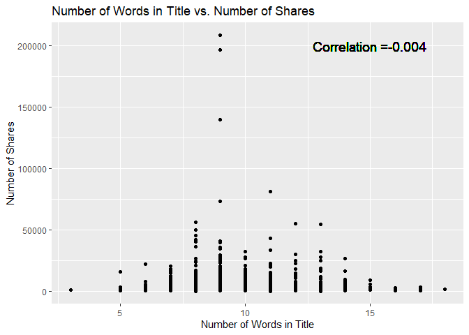
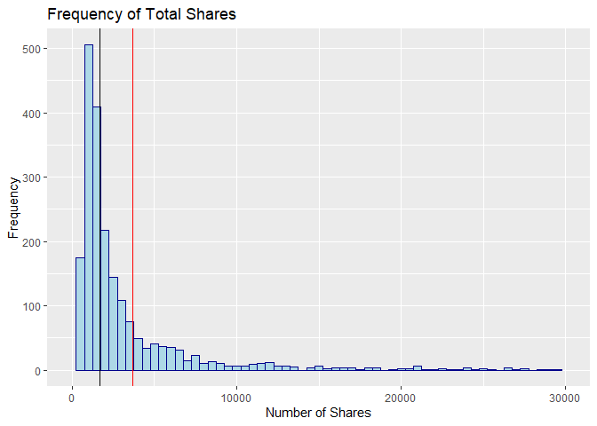
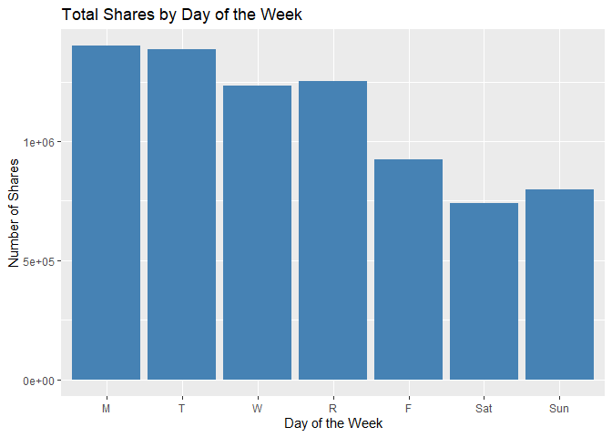
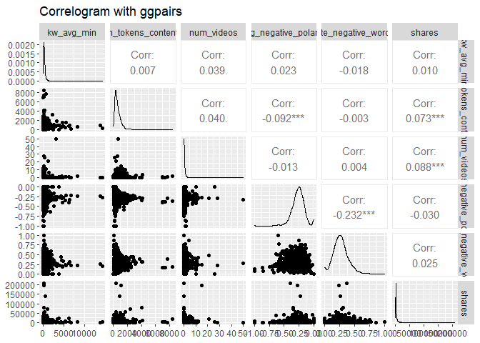
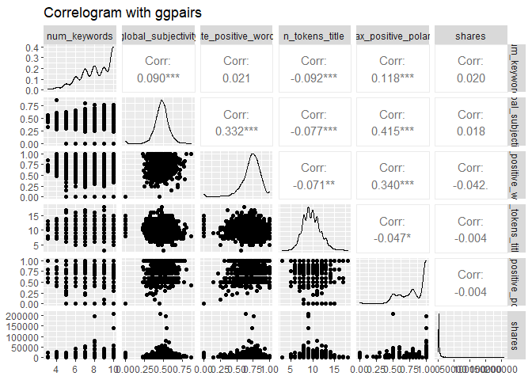
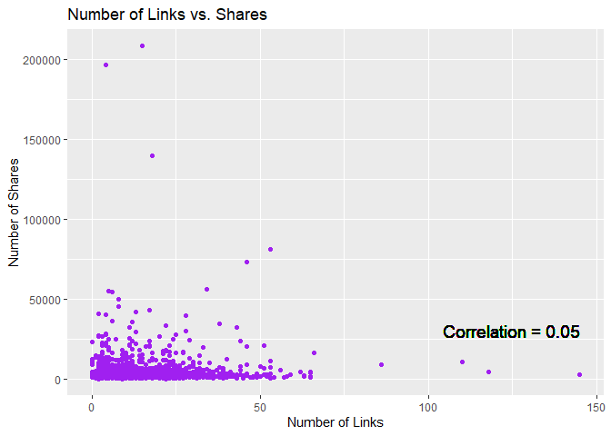
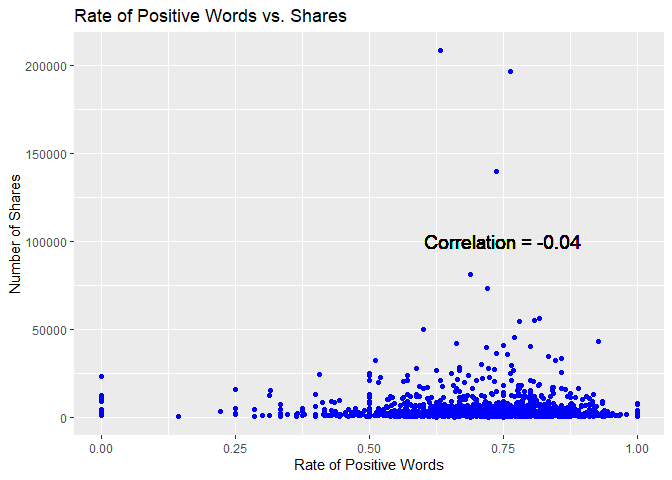

Project 2 - Predictive Models
================
Alex Prevatte & Chennade Brown  
10/31/2021

-   [Introduction](#introduction)
-   [Data](#data)
-   [Summarizations](#summarizations)
-   [Modeling](#modeling)
-   [Comparison](#comparison)
-   [Automation](#automation)

## Introduction

Our project involves creating predictive models and automating Markdown
reports for each article topic (Lifestyle, Social Media, Business,
World, Entertainment, and Technology) using the [Online News Popularity
Data
Set](https://archive.ics.uci.edu/ml/datasets/Online+News+Popularity).
This dataset contains quantitative information including the number of
words, images, and links, as well as qualitative information such as
article topic and day published. The goal of this report is to predict
the number of shares for each article topic using linear regression,
random forest, and boosted tree models. Our team used 55 prediction
attributes for ensemble methods and a combination of the following
attributes for linear regression to predict article shares:

`n_tokens_title` : Number of words in the title `n_tokens_content` :
Number of words in the content `rate_positive_words` : Rate of positive
words among non-neutral tokens `num_hrefs` : Number of links `num_imgs`
: Number of images `num_keywords` : Number of keywords in the metadata
`global_subjectivity` : Text subjectivity `max_positive_polarity` : Max.
polarity of positive words `num_imgs` : Number of images `kw_avg_avg` :
Avg. keyword (avg. shares) `kw_min_avg` : Avg. keyword (min. shares)
`kw_max_avg` : Avg. keyword (max. shares)

``` r
library(tidyverse)
library(dplyr)
library(knitr)
library(GGally)
library(corrplot)
library(caret)
library(randomForest)
```

## Data

``` r
# Import the Data.
 onlineNews <- read_csv("OnlineNewsPopularity.csv")
```

``` r
# Start with using data from a single data_channel_is_* source

# Filtered rows for data_channel_is_lifestyle and removed other 5 categories. 
# Removed non-predictive variables (URL, Timedelta).

onlineNewsLifestyle <- onlineNews %>% filter(`data_channel_is_lifestyle` ==  1) %>% 
  select(- c(`data_channel_is_bus`, `data_channel_is_entertainment`,
             `data_channel_is_socmed`, `data_channel_is_tech`,
             `data_channel_is_world`, url, `timedelta`))

# Remove space in front of each column name
names(onlineNewsLifestyle) <- sub(" ", "", names(onlineNewsLifestyle))

# Convert to dataframe for plotting
onlineNewsLifestyle <- data.frame(onlineNewsLifestyle)
```

## Summarizations

``` r
# Summary statistics for shares
sum <- summary(onlineNewsLifestyle$shares)
std <- sd(onlineNewsLifestyle$shares)
# Median and mean to be used for histogram plot
median <- sum[3]
mean <- sum[4]
print(sum)
```

    ##    Min. 1st Qu.  Median    Mean 3rd Qu.    Max. 
    ##      28    1100    1700    3682    3250  208300

``` r
# Summary statistics for Number of Words in Title
sum <- summary(onlineNewsLifestyle$n_tokens_title)
std <- sd(onlineNewsLifestyle$n_tokens_title)
print(sum)
```

    ##    Min. 1st Qu.  Median    Mean 3rd Qu.    Max. 
    ##   3.000   8.000  10.000   9.766  11.000  18.000

``` r
# Summary statistics for Number of Words in Content
sum <- summary(onlineNewsLifestyle$n_tokens_content)
std <- sd(onlineNewsLifestyle$n_tokens_content)
print(sum)
```

    ##    Min. 1st Qu.  Median    Mean 3rd Qu.    Max. 
    ##     0.0   308.5   502.0   621.3   795.0  8474.0

``` r
# Create Day variable to combine days for contingency table
dayShares <- onlineNewsLifestyle %>% 
  mutate(Day = if_else(weekday_is_monday == 1, "M",
                          if_else(weekday_is_tuesday == 1, "T",
                                  if_else(weekday_is_wednesday == 1, "W", 
                                          if_else(weekday_is_thursday == 1, "R",
                                                  if_else(weekday_is_friday == 1,"F",
                                                          if_else(weekday_is_saturday == 1,"Sat",
                                                                  if_else(weekday_is_sunday == 1,"Sun", "NULL"))))))))

# Add Popular variable for rows where shares is greater than the median
dayShares <- dayShares %>% mutate(Popular = 
                                    ifelse(shares > median, "Yes", "No")) %>% select(Popular, everything())

# Contingency table for day of the week and shares greater than the median
table(dayShares$Popular, factor(dayShares$Day, levels = c("M", "T", "W", 
                                                          "R", "F", "Sat", "Sun")))
```

    ##      
    ##         M   T   W   R   F Sat Sun
    ##   No  175 196 215 201 167  71  80
    ##   Yes 147 138 173 157 138 111 130

``` r
# Table of shares for each day
tableTotal <- aggregate(dayShares$shares, by=list(Day=dayShares$Day), FUN=sum)
colnames(tableTotal) <- c("Day", "Total_Shares")
tableTotal$Day <- factor(tableTotal$Day, levels = c("M", "T", "W", 
                                                          "R", "F", "Sat", "Sun"))
tableTotal
```

    ##   Day Total_Shares
    ## 1   F       922890
    ## 2   M      1399319
    ## 3   R      1253096
    ## 4 Sat       739366
    ## 5 Sun       795979
    ## 6   T      1386933
    ## 7   W      1231194

``` r
# Scatterplot of Number of Words in Title vs. Number of Shares
titleCorrelation <- cor(onlineNewsLifestyle$shares, onlineNewsLifestyle$n_tokens_title)

ggplot(onlineNewsLifestyle, aes(n_tokens_title, shares)) + 
  labs(y = "Number of Shares", x = "Number of Words in Title") +
  ggtitle("Number of Words in Title vs. Number of Shares") +
  geom_point() + 
  geom_text(x = 15, y = 200000, size = 5, 
            label = paste0("Correlation =", round(titleCorrelation, 3)))
```

<!-- -->

``` r
# Histogram of Total Shares. Mean and Median vertical lines have been included.
ggplot(onlineNewsLifestyle, aes(x=shares)) +
  labs(y = "Frequency", x = "Number of Shares") +
  ggtitle("Frequency of Total Shares") +
  geom_histogram(binwidth = 500, color="darkblue", fill="lightblue") +
  xlim(0,30000) +
  geom_vline(aes(xintercept = median), colour="black") + 
  geom_vline(aes(xintercept = mean), colour="red")
```

<!-- -->

``` r
# Barplot of Total Shares vs. Day of the Week 
ggplot(tableTotal, aes(x=Day, y = Total_Shares)) +
  geom_bar(stat="identity", fill = "steelblue") +
  labs(y = "Number of Shares", x = "Day of the Week") +
  ggtitle("Total Shares by Day of the Week") 
```

<!-- -->

``` r
# Summary statistics for the number of words in the content.
sumWords <- summary(onlineNewsLifestyle$n_tokens_content)
sumWords
```

    ##    Min. 1st Qu.  Median    Mean 3rd Qu.    Max. 
    ##     0.0   308.5   502.0   621.3   795.0  8474.0

``` r
# Summary statistics for the number of links in the content. 
sumLinks <- summary(onlineNewsLifestyle$num_hrefs)
sumLinks
```

    ##    Min. 1st Qu.  Median    Mean 3rd Qu.    Max. 
    ##    0.00    6.00   10.00   13.42   18.00  145.00

``` r
# Summary statistics for the number of images in the content.
sumImages <- summary(onlineNewsLifestyle$num_imgs)
sumImages
```

    ##    Min. 1st Qu.  Median    Mean 3rd Qu.    Max. 
    ##   0.000   1.000   1.000   4.905   8.000 111.000

``` r
# Add Word variable for words to include low, average, and high word count and combine with dayshares dataframe for contingency table.
wordLinkShares <- dayShares %>% mutate(Words = if_else(n_tokens_content <= 500, "Low", if_else(n_tokens_content <= 625, "Average", "High")))
```

``` r
# Add Link variable for the number of links in the content to include low, average, and high count.
wordLinkShares <- wordLinkShares %>% mutate(Links = if_else(num_hrefs <= 9, "Low", if_else(num_hrefs <= 14, "Average","High")))

# Remove extra columns added to onLineNewsLifestyle.
onlineNewsLifestyle$WordCount <- NULL
onlineNewsLifestyle$Popular <- NULL
onlineNewsLifestyle$Words <- NULL
onlineNewsLifestyle$Links <- NULL
onlineNewsLifestyle$Day <- NULL
```

``` r
# Contingency table for the number of words in the content based on grouping the word count into categories of low, average, and high word count and grouping the shares based on popularity (shares greater than the median).
table(wordLinkShares$Popular, factor(wordLinkShares$Words, levels = c("Low", "Average", "High")))
```

    ##      
    ##       Low Average High
    ##   No  579     142  384
    ##   Yes 468     136  390

``` r
# Contingency table for the number of links in the content based on grouping the link count into categories of low, average,and high and shares based on popularity (shares greater than the median)
table(wordLinkShares$Popular, factor(wordLinkShares$Links, levels = c("Low", "Average", "High")))
```

    ##      
    ##       Low Average High
    ##   No  544     246  315
    ##   Yes 435     191  368

``` r
# Select predictors to view in GGPairs plot.
xpred <- onlineNewsLifestyle %>% select(kw_avg_min, n_tokens_content, num_videos, avg_negative_polarity, rate_negative_words, shares)

xpred2 <- onlineNewsLifestyle %>% select(num_keywords, global_subjectivity, rate_positive_words, n_tokens_title, max_positive_polarity, shares)

# GGPairs plot to view correlation among the predictors.  Correlation greater than 75% indicates the predictors are highly correlated.
ggpairs(xpred, title = "Correlogram with ggpairs")
```

<!-- -->

``` r
ggpairs(xpred2, title = "Correlogram with ggpairs")
```

<!-- -->

``` r
# The following scatterplot shows the trend of shares as a function of the number of links in the content.  An upward trend in the points indicates that articles with more links are shared more often.  A downward trend would indicate that articles with more links are shared less often.  If there is neither an upward or downward trend this indicates that the number of links in the article has no effect on whether the article will be shared.
correlation <- cor(onlineNewsLifestyle$shares, onlineNewsLifestyle$num_hrefs)  
g <- ggplot(onlineNewsLifestyle, aes(x = num_hrefs, y = shares)) + labs(y ="Number of Shares", x = "Number of Links")
g + geom_point(col = "purple") + ggtitle("Number of Links vs. Shares") + geom_text(x = 125, y = 30000, size = 5, label = paste0("Correlation = ", round(correlation, 2)))
```

<!-- -->

``` r
# The following scatterplot shows the relationship between the rate of positive words in the articles and the number of shares.  If the plots are on an upward trajectory then articles with more positive words are shared the most.  If the plots are on a downward trend then the articles with the most positive words are shared the least.
correlationTwo <- cor(onlineNewsLifestyle$shares, onlineNewsLifestyle$rate_positive_words)  
g <- ggplot(onlineNewsLifestyle, aes(x = rate_positive_words, y = shares)) + labs(y ="Number of Shares", x = "Rate of Positive Words")
g + geom_point(col = "blue") + ggtitle("Rate of Positive Words vs. Shares") + geom_text(x = 0.75, y = 100000, size = 5, label = paste0("Correlation = ", round(correlationTwo, 2)))
```

<!-- -->

## Modeling

``` r
# Split the data into a training (70% of the data) and test set (30% of the data).
set.seed(90)
trainIndex <- createDataPartition(onlineNewsLifestyle$shares, p = 0.7, list = FALSE)
onlineNewsTrain <- onlineNewsLifestyle[trainIndex, ]
onlineNewsTest <- onlineNewsLifestyle[-trainIndex, ]
dim(onlineNewsTrain)
```

    ## [1] 1472   54

``` r
dim(onlineNewsTest)
```

    ## [1] 627  54

### Linear Regression Models

A linear regression model is a model used to determine the relationship
between two or more variables by fitting a linear equation to the data.
The linear equation is in the form of: Y = Bo + B1X + E where Y is the
response variable, X is the explanatory variable, Bo is the y intercept,
and B1 is the slope. The model can be used to predict the value of the
response variable based on the values of the explanatory variables. For
example a linear regression model can be used to model the relationship
between years of experience and salary.

``` r
# Store model one in a formula.
modelOne <- as.formula("shares ~ n_tokens_content + n_tokens_title + rate_positive_words + num_keywords + global_subjectivity + max_positive_polarity + num_imgs")

# Model fit on the training data.
fit1 <- train(modelOne, data = onlineNewsTrain,
              method = "lm",
              preProcess = c("center", "scale"),
              trControl = trainControl(method = "cv", number = 10))
fit1
```

    ## Linear Regression 
    ## 
    ## 1472 samples
    ##    7 predictor
    ## 
    ## Pre-processing: centered (7), scaled (7) 
    ## Resampling: Cross-Validated (10 fold) 
    ## Summary of sample sizes: 1324, 1325, 1324, 1325, 1324, 1325, ... 
    ## Resampling results:
    ## 
    ##   RMSE      Rsquared    MAE     
    ##   8388.512  0.01659042  3365.702
    ## 
    ## Tuning parameter 'intercept' was held constant at a value of TRUE

``` r
# Backward selection chosen for additional linear model
modelTwo <- as.formula("shares ~ kw_avg_avg + kw_min_avg + kw_max_avg + num_hrefs + n_tokens_content")

# Model fit on training data
fit2 <- train(modelTwo, data = onlineNewsTrain,
              method = "lm",
              preProcess = c("center", "scale"),
              trControl = trainControl(method = "cv", number = 10))
fit2
```

    ## Linear Regression 
    ## 
    ## 1472 samples
    ##    5 predictor
    ## 
    ## Pre-processing: centered (5), scaled (5) 
    ## Resampling: Cross-Validated (10 fold) 
    ## Summary of sample sizes: 1325, 1325, 1326, 1325, 1324, 1325, ... 
    ## Resampling results:
    ## 
    ##   RMSE      Rsquared    MAE     
    ##   8651.633  0.02847098  3375.921
    ## 
    ## Tuning parameter 'intercept' was held constant at a value of TRUE

### Random Forest Model

Random Forest models are an extension of the tree based method bagging.
The random forest algorithm creates multiple trees from bootstrapped
samples, averages those results, and uses a random subset of predictors
for each bootstrap sample/tree fit. Random forests can be used for
classification and regression problems.

``` r
rfFit <- train(shares ~., data = onlineNewsTrain, 
               method = "rf", 
               trainControl = trainControl(method = "cv",
                                           number = 5),
               tuneGrid = data.frame(mtry = 1:10))
rfFit
```

    ## Random Forest 
    ## 
    ## 1472 samples
    ##   53 predictor
    ## 
    ## No pre-processing
    ## Resampling: Bootstrapped (25 reps) 
    ## Summary of sample sizes: 1472, 1472, 1472, 1472, 1472, 1472, ... 
    ## Resampling results across tuning parameters:
    ## 
    ##   mtry  RMSE       Rsquared     MAE     
    ##    1     9850.106  0.006317247  3472.434
    ##    2     9917.975  0.005498290  3578.743
    ##    3     9979.218  0.005205870  3626.947
    ##    4    10039.005  0.005000085  3667.360
    ##    5    10106.745  0.004216543  3695.256
    ##    6    10161.242  0.004083015  3721.468
    ##    7    10222.370  0.004102724  3738.604
    ##    8    10283.421  0.003664490  3762.136
    ##    9    10339.646  0.003640799  3778.907
    ##   10    10387.953  0.003307873  3790.091
    ## 
    ## RMSE was used to select the optimal model using the smallest value.
    ## The final value used for the model was mtry = 1.

### Boosted Tree Model

Boosting is an ensemble tree-based method used for regression and
classification. Boosting seeks to improve prediction by training on
decision trees which are grown sequentially. Each subsequent tree is
grown on a modified version of the original data. The predictions are
then updated as new trees are grown, minimizing the error of the
previous tree. The parameters used in boosting are the number of trees,
interaction depth (number of splits on a tree), shrinkage, and minimum
number of observations in trees’ terminal nodes.

``` r
# Boosted tree. After examining ranges of values for number of trees and interaction depth, 25 trees with an interaction depth of 1 had the lowest test RMSE.
boostedGrid <- expand.grid(
  interaction.depth=c(1:4), 
  n.trees=c(25,50,100,150,200),
  shrinkage=0.1,
  n.minobsinnode=10
)

boostedTree <- train(shares ~. -data_channel_is_lifestyle, 
                     data = onlineNewsTrain,
             method = "gbm",
             preProcess = c("center", "scale"),
             trControl = trainControl(method = "repeatedcv", number = 5,
                                      repeats = 3),
             tuneGrid = boostedGrid)
```

    ## Iter   TrainDeviance   ValidDeviance   StepSize   Improve
    ##      1 86801496.9872             nan     0.1000 19883.8097
    ##      2 86254750.0038             nan     0.1000 -214559.3537
    ##      3 85945074.2484             nan     0.1000 -260007.1756
    ##      4 85435409.0919             nan     0.1000 371609.7667
    ##      5 84914278.1520             nan     0.1000 125359.5847
    ##      6 84694384.4658             nan     0.1000 -64734.5827
    ##      7 84490072.7775             nan     0.1000 -376930.3838
    ##      8 84129444.4689             nan     0.1000 201909.8067
    ##      9 84009356.0083             nan     0.1000 -472886.6101
    ##     10 83751552.5992             nan     0.1000 151100.1004
    ##     20 82309413.7242             nan     0.1000 180609.1037
    ##     40 80171896.2823             nan     0.1000 -449846.0169
    ##     60 79012581.6512             nan     0.1000 -175627.3836
    ##     80 77182219.1439             nan     0.1000 -381692.2061
    ##    100 75940235.4704             nan     0.1000 208955.9188
    ##    120 74194234.8815             nan     0.1000 -185330.4989
    ##    140 73334068.7493             nan     0.1000 -206821.1109
    ##    160 71765820.9720             nan     0.1000 -460476.6151
    ##    180 70903604.0394             nan     0.1000 104750.0033
    ##    200 70131234.3519             nan     0.1000 -217875.0023
    ## 
    ## Iter   TrainDeviance   ValidDeviance   StepSize   Improve
    ##      1 86581944.9871             nan     0.1000 252523.2423
    ##      2 86111200.8041             nan     0.1000 -7226.2289
    ##      3 86046150.7885             nan     0.1000 -73969.0435
    ##      4 85302166.8032             nan     0.1000 -179757.0885
    ##      5 84612062.6995             nan     0.1000 -180477.9692
    ##      6 84082225.7263             nan     0.1000 134046.4854
    ##      7 83977628.7824             nan     0.1000 -466307.1039
    ##      8 83644878.6097             nan     0.1000 -904075.1016
    ##      9 82679198.9528             nan     0.1000 -415841.9943
    ##     10 82418005.0464             nan     0.1000 44221.1748
    ##     20 78829470.4719             nan     0.1000 -632188.3178
    ##     40 74763078.6877             nan     0.1000 -342060.9510
    ##     60 72359430.8497             nan     0.1000 -258828.9994
    ##     80 68901061.8003             nan     0.1000 -340026.0006
    ##    100 65984348.2177             nan     0.1000 -404648.1101
    ##    120 63438683.9730             nan     0.1000 -367889.2470
    ##    140 61432242.4569             nan     0.1000 -162610.6941
    ##    160 59877591.8531             nan     0.1000 -103566.8836
    ##    180 58527861.2517             nan     0.1000 -276523.0561
    ##    200 56236360.2122             nan     0.1000 -208006.2951
    ## 
    ## Iter   TrainDeviance   ValidDeviance   StepSize   Improve
    ##      1 86705531.0992             nan     0.1000 287064.4625
    ##      2 85956985.5981             nan     0.1000 -3564.2015
    ##      3 84837398.1535             nan     0.1000 -72882.8452
    ##      4 84153281.4420             nan     0.1000 -178477.5333
    ##      5 83705159.9862             nan     0.1000 -307072.8006
    ##      6 83350481.6422             nan     0.1000 -74742.9913
    ##      7 83073340.3739             nan     0.1000 -152784.2401
    ##      8 82860444.3986             nan     0.1000 -348283.0359
    ##      9 82412886.6994             nan     0.1000 -192702.9072
    ##     10 81982101.7888             nan     0.1000 -311920.4508
    ##     20 78888157.6538             nan     0.1000 -77301.6977
    ##     40 72003999.5034             nan     0.1000 -196977.3245
    ##     60 67208218.6647             nan     0.1000 -323554.0940
    ##     80 63129849.7454             nan     0.1000 -128914.1854
    ##    100 60369499.7533             nan     0.1000 -428001.0270
    ##    120 57075254.9439             nan     0.1000 -521332.4852
    ##    140 54437295.1324             nan     0.1000 -468265.8157
    ##    160 51240052.0718             nan     0.1000 -230346.8629
    ##    180 49080055.2419             nan     0.1000 -111036.3434
    ##    200 47327757.5462             nan     0.1000 -267955.1154
    ## 
    ## Iter   TrainDeviance   ValidDeviance   StepSize   Improve
    ##      1 86510377.0084             nan     0.1000 308366.8401
    ##      2 85986458.5346             nan     0.1000 -137568.4251
    ##      3 85553284.8448             nan     0.1000 -272086.9906
    ##      4 85005708.7731             nan     0.1000 131921.6483
    ##      5 83970327.3629             nan     0.1000 -135832.4292
    ##      6 82816104.4468             nan     0.1000 -503850.5773
    ##      7 82381156.3849             nan     0.1000 -463850.4821
    ##      8 82188439.7079             nan     0.1000 -482943.6762
    ##      9 81670803.5619             nan     0.1000 -167910.2156
    ##     10 81223168.3685             nan     0.1000 -793136.0913
    ##     20 75850370.8173             nan     0.1000 -823095.5156
    ##     40 70504381.7875             nan     0.1000 -307137.0866
    ##     60 67052496.1840             nan     0.1000 -263086.4372
    ##     80 61169837.2478             nan     0.1000 -369690.3151
    ##    100 57826724.8018             nan     0.1000 -235401.4990
    ##    120 55778345.6136             nan     0.1000 -445036.2454
    ##    140 53219117.0050             nan     0.1000 -499704.5961
    ##    160 50450699.0500             nan     0.1000 -317073.5985
    ##    180 47175642.6882             nan     0.1000 -85338.5910
    ##    200 44902895.6107             nan     0.1000 -610925.4833
    ## 
    ## Iter   TrainDeviance   ValidDeviance   StepSize   Improve
    ##      1 105590287.0530             nan     0.1000 -197949.0472
    ##      2 105153251.4922             nan     0.1000 -94730.9905
    ##      3 104793668.8983             nan     0.1000 -157373.6223
    ##      4 104580065.9515             nan     0.1000 -123216.2493
    ##      5 104486467.2919             nan     0.1000 -8618.4038
    ##      6 104226416.8108             nan     0.1000 -133674.6573
    ##      7 104004822.4672             nan     0.1000 -121150.8161
    ##      8 103711362.9243             nan     0.1000 -472012.6211
    ##      9 103465778.2657             nan     0.1000 -128200.3902
    ##     10 103243710.3722             nan     0.1000 -318710.6136
    ##     20 102212891.4229             nan     0.1000 -329056.1978
    ##     40 100789138.2868             nan     0.1000 -510842.4348
    ##     60 99677643.0819             nan     0.1000 -464879.9170
    ##     80 98164152.4081             nan     0.1000 120696.5217
    ##    100 97384311.1705             nan     0.1000 -379235.3526
    ##    120 96423842.4082             nan     0.1000 -437021.8569
    ##    140 95934933.3865             nan     0.1000 -443968.9473
    ##    160 95848708.2451             nan     0.1000 -499446.3772
    ##    180 95374492.4919             nan     0.1000 -291350.8936
    ##    200 95076823.4360             nan     0.1000 -243780.7470
    ## 
    ## Iter   TrainDeviance   ValidDeviance   StepSize   Improve
    ##      1 105788495.4344             nan     0.1000 -184651.3521
    ##      2 105473831.2601             nan     0.1000 -1051.8919
    ##      3 104525598.0973             nan     0.1000 -265899.6323
    ##      4 104075743.7067             nan     0.1000 -274891.6267
    ##      5 103627838.3269             nan     0.1000 -176081.8777
    ##      6 103489643.9295             nan     0.1000 -162363.0966
    ##      7 103040453.4399             nan     0.1000 -254790.6446
    ##      8 102888647.7822             nan     0.1000 -313585.4570
    ##      9 102879701.5215             nan     0.1000 -150062.0268
    ##     10 102605318.2146             nan     0.1000 -119600.5959
    ##     20 100562523.7084             nan     0.1000 -314251.2806
    ##     40 94029487.2359             nan     0.1000 -213858.9122
    ##     60 87415220.0353             nan     0.1000 -62510.5894
    ##     80 84344547.3885             nan     0.1000 -481904.6313
    ##    100 79791412.6715             nan     0.1000 -277958.4739
    ##    120 77869312.1336             nan     0.1000 -413428.8092
    ##    140 75249275.9839             nan     0.1000 -355885.4216
    ##    160 72899091.4537             nan     0.1000 -455850.7400
    ##    180 70700877.6518             nan     0.1000 -368217.7398
    ##    200 69887769.9741             nan     0.1000 -351262.3033
    ## 
    ## Iter   TrainDeviance   ValidDeviance   StepSize   Improve
    ##      1 105338669.0705             nan     0.1000 -99749.3820
    ##      2 105199157.7003             nan     0.1000 -103019.7641
    ##      3 104828039.1345             nan     0.1000 -73135.7316
    ##      4 104427321.0944             nan     0.1000 -194649.8434
    ##      5 103515416.1225             nan     0.1000 -388663.6318
    ##      6 102938280.2417             nan     0.1000 -314243.1361
    ##      7 102214351.1464             nan     0.1000 -514423.7720
    ##      8 102020677.6769             nan     0.1000 -321294.0604
    ##      9 101592304.6444             nan     0.1000 -803850.7995
    ##     10 101516630.0670             nan     0.1000 -1058864.2697
    ##     20 98065896.3915             nan     0.1000 -757888.3099
    ##     40 89014321.0581             nan     0.1000 -37449.2791
    ##     60 87750981.3497             nan     0.1000 -182023.5732
    ##     80 83219986.2589             nan     0.1000 -871244.2855
    ##    100 77919658.3257             nan     0.1000 -658078.1333
    ##    120 77212412.1699             nan     0.1000 -394772.5076
    ##    140 73958182.4462             nan     0.1000 -502574.9413
    ##    160 69563989.4762             nan     0.1000 -451210.1636
    ##    180 65120815.2871             nan     0.1000 -831079.8653
    ##    200 62894104.1035             nan     0.1000 -346181.9046
    ## 
    ## Iter   TrainDeviance   ValidDeviance   StepSize   Improve
    ##      1 105535075.4801             nan     0.1000 -246550.1086
    ##      2 104529870.2106             nan     0.1000 -64621.9664
    ##      3 103808002.4255             nan     0.1000 -93895.9354
    ##      4 103593677.3318             nan     0.1000 -94552.4952
    ##      5 103316886.6856             nan     0.1000 -249529.0785
    ##      6 101909403.6156             nan     0.1000 -483783.9766
    ##      7 101688243.0691             nan     0.1000 -149627.6569
    ##      8 101350819.0120             nan     0.1000 -395109.8242
    ##      9 100943826.3019             nan     0.1000 -295573.4874
    ##     10 100532342.3716             nan     0.1000 -182116.4151
    ##     20 98481093.7305             nan     0.1000 -377598.0615
    ##     40 88436645.2871             nan     0.1000 -481341.3794
    ##     60 80332846.8700             nan     0.1000 -572133.4317
    ##     80 75356093.2216             nan     0.1000 -272279.9097
    ##    100 69176051.2472             nan     0.1000 -336618.7805
    ##    120 67442127.0896             nan     0.1000 -438664.5818
    ##    140 63275449.2678             nan     0.1000 -273745.8543
    ##    160 57878992.6888             nan     0.1000 -262885.7405
    ##    180 54927535.6656             nan     0.1000 -491437.0721
    ##    200 51365479.2115             nan     0.1000 -301761.5758
    ## 
    ## Iter   TrainDeviance   ValidDeviance   StepSize   Improve
    ##      1 118205862.0001             nan     0.1000 -113564.3626
    ##      2 117753815.7332             nan     0.1000 59974.7508
    ##      3 117223914.8468             nan     0.1000 -156065.9288
    ##      4 116757097.8352             nan     0.1000 -353824.8083
    ##      5 116475400.2847             nan     0.1000 -90707.4636
    ##      6 116301117.1587             nan     0.1000 -227924.5417
    ##      7 116040662.6662             nan     0.1000 89756.2357
    ##      8 115735004.5002             nan     0.1000 -113020.1809
    ##      9 115399668.5452             nan     0.1000 -339711.5209
    ##     10 115181411.6264             nan     0.1000 -128982.1927
    ##     20 114045110.7095             nan     0.1000 -474726.1215
    ##     40 111663016.5752             nan     0.1000 -27900.6047
    ##     60 109463616.4954             nan     0.1000 -382968.9566
    ##     80 108094689.8558             nan     0.1000 -448626.9980
    ##    100 106197457.1368             nan     0.1000 118119.6630
    ##    120 104905369.3337             nan     0.1000 -435177.0813
    ##    140 104082742.2881             nan     0.1000 -571185.7894
    ##    160 103263514.9594             nan     0.1000 -277360.5867
    ##    180 102810595.0281             nan     0.1000 -404166.0640
    ##    200 102368150.1265             nan     0.1000 -230867.8310
    ## 
    ## Iter   TrainDeviance   ValidDeviance   StepSize   Improve
    ##      1 117863717.7597             nan     0.1000 -206789.9376
    ##      2 117496646.6756             nan     0.1000 198230.1020
    ##      3 116625475.6857             nan     0.1000 10754.4011
    ##      4 115851482.3782             nan     0.1000 -351482.2680
    ##      5 115342853.6851             nan     0.1000 -75896.2928
    ##      6 114781667.5038             nan     0.1000 -59799.9657
    ##      7 114351947.8085             nan     0.1000 -260581.1740
    ##      8 112863927.3423             nan     0.1000 -561914.6353
    ##      9 112328711.1356             nan     0.1000 -251885.6492
    ##     10 112079740.4728             nan     0.1000 -508196.7343
    ##     20 109485979.8994             nan     0.1000 -274745.3251
    ##     40 101644797.6947             nan     0.1000 -84632.9626
    ##     60 98174240.1005             nan     0.1000 -414492.4777
    ##     80 95918173.3159             nan     0.1000 -540599.3555
    ##    100 92243142.1650             nan     0.1000 -523052.5550
    ##    120 89200715.6838             nan     0.1000 -500537.0575
    ##    140 85197946.4200             nan     0.1000 -335896.5831
    ##    160 82058559.5145             nan     0.1000 -68674.8613
    ##    180 80436680.8680             nan     0.1000 -216119.3324
    ##    200 77330169.7686             nan     0.1000 -98806.5907
    ## 
    ## Iter   TrainDeviance   ValidDeviance   StepSize   Improve
    ##      1 117213351.1809             nan     0.1000 -321673.7934
    ##      2 116069534.5781             nan     0.1000 -441607.0383
    ##      3 115495397.5884             nan     0.1000 -76656.9266
    ##      4 114922483.6577             nan     0.1000 -416439.7917
    ##      5 114340028.6384             nan     0.1000 -375857.9053
    ##      6 112695507.9302             nan     0.1000 -111340.2776
    ##      7 112183720.4456             nan     0.1000 -155081.9066
    ##      8 110959612.9249             nan     0.1000 -14370.1354
    ##      9 110651462.8123             nan     0.1000 -225274.4471
    ##     10 110355989.7003             nan     0.1000 -398369.7541
    ##     20 103553751.7917             nan     0.1000 -1033348.9974
    ##     40 96522618.3246             nan     0.1000 -384976.6624
    ##     60 89970452.1903             nan     0.1000 -509825.0193
    ##     80 81346919.9195             nan     0.1000 -548186.5429
    ##    100 73844577.1868             nan     0.1000 -265036.6321
    ##    120 69232872.0851             nan     0.1000 -305697.5189
    ##    140 65280426.5948             nan     0.1000 -180788.8659
    ##    160 61726486.6494             nan     0.1000 -491417.7213
    ##    180 58793306.3784             nan     0.1000 -375735.8879
    ##    200 55779827.9739             nan     0.1000 -477965.7697
    ## 
    ## Iter   TrainDeviance   ValidDeviance   StepSize   Improve
    ##      1 117694820.2431             nan     0.1000 156056.4232
    ##      2 116970069.5081             nan     0.1000 -81069.5681
    ##      3 115843271.9473             nan     0.1000 173016.0637
    ##      4 113422789.9561             nan     0.1000 -992622.3139
    ##      5 112600357.8345             nan     0.1000 -347870.9450
    ##      6 111458045.5877             nan     0.1000 -284367.6512
    ##      7 110801404.8597             nan     0.1000 -293393.2064
    ##      8 110294914.5318             nan     0.1000 -437038.7438
    ##      9 110008941.0265             nan     0.1000 -739929.6934
    ##     10 109619624.5392             nan     0.1000 -185218.3660
    ##     20 103541090.3743             nan     0.1000 -740394.3345
    ##     40 96257704.8990             nan     0.1000 -909337.2811
    ##     60 88613026.1657             nan     0.1000 -1179616.8073
    ##     80 81434993.0636             nan     0.1000 -707796.7044
    ##    100 76467891.0054             nan     0.1000 -719237.7333
    ##    120 70056300.5360             nan     0.1000 -285815.4764
    ##    140 63320567.9629             nan     0.1000 -462535.1963
    ##    160 60950551.9104             nan     0.1000 -129357.3990
    ##    180 58295417.5993             nan     0.1000 -307197.6820
    ##    200 55122968.9687             nan     0.1000 -201606.8489
    ## 
    ## Iter   TrainDeviance   ValidDeviance   StepSize   Improve
    ##      1 113051737.1474             nan     0.1000 -123696.6420
    ##      2 112689548.2940             nan     0.1000 -103436.1800
    ##      3 112321256.8573             nan     0.1000 -39791.4362
    ##      4 111922353.6462             nan     0.1000 -50885.4366
    ##      5 111614726.7155             nan     0.1000 -285568.8744
    ##      6 111380093.1156             nan     0.1000 -72481.4358
    ##      7 111095643.4905             nan     0.1000 -132325.0391
    ##      8 110851359.7745             nan     0.1000 -243538.1897
    ##      9 110626839.8920             nan     0.1000 -349067.3435
    ##     10 110542250.1432             nan     0.1000 -523591.2740
    ##     20 109528979.1096             nan     0.1000 -47829.0911
    ##     40 107382735.8805             nan     0.1000 -521248.8576
    ##     60 105625904.4668             nan     0.1000 -399494.9358
    ##     80 104160640.1507             nan     0.1000 -291011.3243
    ##    100 103106878.9939             nan     0.1000 -327183.7863
    ##    120 102195944.3921             nan     0.1000 -212240.3352
    ##    140 101328354.1169             nan     0.1000 -74364.8466
    ##    160 100555888.6725             nan     0.1000 -109446.8308
    ##    180 100079278.5234             nan     0.1000 -130627.3141
    ##    200 99466757.8277             nan     0.1000 -547839.4588
    ## 
    ## Iter   TrainDeviance   ValidDeviance   StepSize   Improve
    ##      1 112855085.7375             nan     0.1000 -134657.8636
    ##      2 112175545.2825             nan     0.1000 -119826.9625
    ##      3 111446860.9148             nan     0.1000 -221677.8089
    ##      4 110528699.7817             nan     0.1000 13617.7421
    ##      5 110434404.7355             nan     0.1000 -119125.5666
    ##      6 109864895.3791             nan     0.1000 -296164.0270
    ##      7 109449842.7487             nan     0.1000 -384071.9906
    ##      8 108896442.8408             nan     0.1000 -70285.0909
    ##      9 108374350.6208             nan     0.1000 -563793.6052
    ##     10 108114761.2585             nan     0.1000 -162836.0163
    ##     20 104373970.2102             nan     0.1000 -639378.5516
    ##     40 98091222.9123             nan     0.1000 -559498.7463
    ##     60 91475054.1708             nan     0.1000 -420403.3566
    ##     80 88541558.6536             nan     0.1000 -924477.5731
    ##    100 86319711.2266             nan     0.1000 -274338.3378
    ##    120 83360126.8386             nan     0.1000 -651331.1258
    ##    140 81984031.7041             nan     0.1000 -485689.3184
    ##    160 80373943.2594             nan     0.1000 -467214.9536
    ##    180 77859231.2021             nan     0.1000 -365574.2876
    ##    200 74543678.5528             nan     0.1000 -459785.7044
    ## 
    ## Iter   TrainDeviance   ValidDeviance   StepSize   Improve
    ##      1 112902253.9408             nan     0.1000 137806.6844
    ##      2 111926336.5833             nan     0.1000 314173.9844
    ##      3 111401503.9204             nan     0.1000 -13400.6900
    ##      4 110123364.3392             nan     0.1000 -95892.3218
    ##      5 109444347.2986             nan     0.1000 -311053.8903
    ##      6 108409923.8678             nan     0.1000 -200533.5973
    ##      7 107222690.1667             nan     0.1000 -1102319.7418
    ##      8 107087994.6845             nan     0.1000 -636727.1873
    ##      9 106896273.3623             nan     0.1000 -511331.4716
    ##     10 106836033.1629             nan     0.1000 -478511.8487
    ##     20 102550007.5640             nan     0.1000 11907.1867
    ##     40 94552231.5106             nan     0.1000 -296662.7947
    ##     60 88338329.1294             nan     0.1000 -477442.8592
    ##     80 81747217.6059             nan     0.1000 -419847.8301
    ##    100 76028694.4941             nan     0.1000 -255032.4436
    ##    120 73075360.5760             nan     0.1000 -227603.9752
    ##    140 69106992.7042             nan     0.1000 -213101.2883
    ##    160 64680101.2392             nan     0.1000 -576262.6205
    ##    180 61873636.8285             nan     0.1000 -406260.9408
    ##    200 58052206.1051             nan     0.1000 -609213.2587
    ## 
    ## Iter   TrainDeviance   ValidDeviance   StepSize   Improve
    ##      1 112789937.2132             nan     0.1000 28722.4546
    ##      2 111425771.4905             nan     0.1000 -194071.8275
    ##      3 111270666.7685             nan     0.1000 -158020.7162
    ##      4 110662341.3627             nan     0.1000 -210312.4200
    ##      5 109808065.2005             nan     0.1000 -265155.6030
    ##      6 109291238.0744             nan     0.1000 -486078.8751
    ##      7 107970238.7136             nan     0.1000 -467523.0249
    ##      8 107381055.8013             nan     0.1000 -325847.8498
    ##      9 107403944.1260             nan     0.1000 -617413.8120
    ##     10 106763605.0188             nan     0.1000 -535917.9265
    ##     20 102051340.7708             nan     0.1000 -778041.4146
    ##     40 95434094.9830             nan     0.1000 -724694.7948
    ##     60 91263129.8462             nan     0.1000 -797458.7833
    ##     80 85097015.9350             nan     0.1000 -546338.2755
    ##    100 82413433.1700             nan     0.1000 -696364.8157
    ##    120 77021163.7250             nan     0.1000 -413005.8253
    ##    140 71598090.0703             nan     0.1000 -575958.7071
    ##    160 68241397.4952             nan     0.1000 -794283.4114
    ##    180 65145084.6206             nan     0.1000 -697219.7576
    ##    200 60732383.4788             nan     0.1000 -383726.0012
    ## 
    ## Iter   TrainDeviance   ValidDeviance   StepSize   Improve
    ##      1 66049126.8311             nan     0.1000 -22856.5063
    ##      2 65556052.7221             nan     0.1000 -50096.0062
    ##      3 64996840.4199             nan     0.1000 -218727.9732
    ##      4 64757542.1504             nan     0.1000 353470.9020
    ##      5 64189024.5338             nan     0.1000 40235.7605
    ##      6 63846365.9687             nan     0.1000 -134580.4750
    ##      7 63433265.5823             nan     0.1000 56782.0795
    ##      8 63239403.0297             nan     0.1000 -158781.0452
    ##      9 63071149.7440             nan     0.1000 -287505.1249
    ##     10 62922648.6157             nan     0.1000 -354961.1331
    ##     20 62001666.3304             nan     0.1000 -908195.7331
    ##     40 60555684.8641             nan     0.1000 -461068.5064
    ##     60 59975801.8480             nan     0.1000 -95326.8160
    ##     80 59519269.4407             nan     0.1000 -515414.4735
    ##    100 59180996.5692             nan     0.1000 -164660.2617
    ##    120 58790171.9105             nan     0.1000 -50092.8007
    ##    140 58586049.2276             nan     0.1000 -231364.4040
    ##    160 58593492.4799             nan     0.1000 -151827.5882
    ##    180 58277655.2922             nan     0.1000 -340700.7802
    ##    200 58126661.9012             nan     0.1000 -383696.0419
    ## 
    ## Iter   TrainDeviance   ValidDeviance   StepSize   Improve
    ##      1 65091462.9433             nan     0.1000 36167.0855
    ##      2 64308536.0514             nan     0.1000 56865.6062
    ##      3 63941383.3250             nan     0.1000 187208.8003
    ##      4 63592058.6336             nan     0.1000 -71020.2368
    ##      5 63382757.6405             nan     0.1000 -460275.4412
    ##      6 63077095.5984             nan     0.1000 -299591.7648
    ##      7 62667054.2381             nan     0.1000 -602136.4444
    ##      8 62403211.2883             nan     0.1000 -101008.4041
    ##      9 61020225.1432             nan     0.1000 -358069.4348
    ##     10 60884219.8789             nan     0.1000 -162589.7421
    ##     20 59784565.3221             nan     0.1000 -157940.0978
    ##     40 57063582.8044             nan     0.1000 -138543.0152
    ##     60 54199900.7963             nan     0.1000 -121396.9176
    ##     80 53319133.2352             nan     0.1000 -292116.1766
    ##    100 51408016.2605             nan     0.1000 -457996.2635
    ##    120 49363730.9693             nan     0.1000 -362245.4166
    ##    140 48830131.8149             nan     0.1000 -156561.7388
    ##    160 47555586.9896             nan     0.1000 -422613.5724
    ##    180 46545971.3086             nan     0.1000 -288781.3713
    ##    200 45511121.1733             nan     0.1000 -117182.2687
    ## 
    ## Iter   TrainDeviance   ValidDeviance   StepSize   Improve
    ##      1 65110290.9703             nan     0.1000 341478.1956
    ##      2 64552597.5432             nan     0.1000 -211569.6605
    ##      3 63723822.3246             nan     0.1000 -73874.4115
    ##      4 63207491.6115             nan     0.1000 24699.6528
    ##      5 62853178.5353             nan     0.1000 -279716.9219
    ##      6 62391868.4738             nan     0.1000 -419121.6949
    ##      7 61903830.9651             nan     0.1000 110616.8987
    ##      8 61596248.5581             nan     0.1000 -254828.3225
    ##      9 61532582.6828             nan     0.1000 -269736.5765
    ##     10 61079745.9320             nan     0.1000 -660553.5615
    ##     20 58220808.6576             nan     0.1000 -552728.2617
    ##     40 55292422.3910             nan     0.1000 -227442.7472
    ##     60 54057414.6960             nan     0.1000 -270900.0005
    ##     80 51836317.8696             nan     0.1000 -622911.3215
    ##    100 46885685.4525             nan     0.1000 -492353.3620
    ##    120 44593912.1994             nan     0.1000 -106292.7310
    ##    140 43545233.3983             nan     0.1000 -445892.9326
    ##    160 41996597.3790             nan     0.1000 -416179.4225
    ##    180 41054814.2218             nan     0.1000 -185082.9966
    ##    200 38294210.5641             nan     0.1000 -428039.0662
    ## 
    ## Iter   TrainDeviance   ValidDeviance   StepSize   Improve
    ##      1 65372778.0523             nan     0.1000 297392.0956
    ##      2 64480991.7421             nan     0.1000 278632.1042
    ##      3 64106645.0791             nan     0.1000 136325.9673
    ##      4 63521604.0309             nan     0.1000 23401.0922
    ##      5 62887113.8965             nan     0.1000 -54638.1397
    ##      6 62260234.0737             nan     0.1000 -163530.7295
    ##      7 61770615.6934             nan     0.1000 -295576.7956
    ##      8 61508884.1144             nan     0.1000 -547918.4068
    ##      9 61124101.3160             nan     0.1000 -232985.2951
    ##     10 60856036.7428             nan     0.1000 -444021.9531
    ##     20 56413070.2448             nan     0.1000 275839.1406
    ##     40 50644518.3154             nan     0.1000 -275849.9829
    ##     60 48055741.1085             nan     0.1000 -352330.7219
    ##     80 45533132.5866             nan     0.1000 -325386.6226
    ##    100 39224292.3280             nan     0.1000 -285276.9366
    ##    120 36503310.9318             nan     0.1000 -119682.5440
    ##    140 34189323.6745             nan     0.1000 -155017.3015
    ##    160 32785245.4211             nan     0.1000 -29489.6718
    ##    180 31377093.7097             nan     0.1000 -235201.6131
    ##    200 29500901.9491             nan     0.1000 -229965.1918
    ## 
    ## Iter   TrainDeviance   ValidDeviance   StepSize   Improve
    ##      1 69403407.6181             nan     0.1000 286486.4630
    ##      2 69194616.2821             nan     0.1000 171028.8222
    ##      3 68937672.1710             nan     0.1000 199282.7738
    ##      4 68592755.3389             nan     0.1000 -1465.8474
    ##      5 68422063.4314             nan     0.1000 24839.2704
    ##      6 68188590.8141             nan     0.1000 5741.3214
    ##      7 68023910.0037             nan     0.1000 121836.5516
    ##      8 67975528.8484             nan     0.1000 -32126.4868
    ##      9 67607140.9493             nan     0.1000 38883.8796
    ##     10 67468080.6764             nan     0.1000 122957.7097
    ##     20 65874180.6072             nan     0.1000 -419374.2258
    ##     40 63378403.1747             nan     0.1000 -146440.4449
    ##     60 61715170.8315             nan     0.1000 -272337.7850
    ##     80 60636718.9871             nan     0.1000 -90796.6377
    ##    100 59721870.9361             nan     0.1000 -202338.4539
    ##    120 59177181.7188             nan     0.1000 -258942.7323
    ##    140 58682237.3803             nan     0.1000 -65224.2721
    ##    160 56940093.1441             nan     0.1000 -62464.6908
    ##    180 56284604.1668             nan     0.1000 -204261.8984
    ##    200 55800387.5635             nan     0.1000 -216808.7751
    ## 
    ## Iter   TrainDeviance   ValidDeviance   StepSize   Improve
    ##      1 68874821.2544             nan     0.1000 301194.1921
    ##      2 68738202.6505             nan     0.1000 -133974.4616
    ##      3 68020954.9718             nan     0.1000 -8604.7633
    ##      4 67927121.4674             nan     0.1000 -43794.6104
    ##      5 67800085.3505             nan     0.1000 -46570.6960
    ##      6 67374582.8538             nan     0.1000 -21822.6279
    ##      7 66993145.2993             nan     0.1000 -228496.1279
    ##      8 66832928.4052             nan     0.1000 120018.0327
    ##      9 66662964.2868             nan     0.1000 -65191.6680
    ##     10 66378832.0095             nan     0.1000 7287.4618
    ##     20 63504268.5625             nan     0.1000 -370565.1930
    ##     40 55844678.1600             nan     0.1000 -301959.5021
    ##     60 51179332.1131             nan     0.1000 -179559.3773
    ##     80 49220181.9269             nan     0.1000 -121859.9410
    ##    100 47028789.4414             nan     0.1000 -187042.6772
    ##    120 46103011.1720             nan     0.1000 -499801.7308
    ##    140 43405675.3802             nan     0.1000 58541.9245
    ##    160 42140532.2724             nan     0.1000 -37468.1136
    ##    180 39866157.9045             nan     0.1000 -201174.8699
    ##    200 38392069.9372             nan     0.1000 -290988.5399
    ## 
    ## Iter   TrainDeviance   ValidDeviance   StepSize   Improve
    ##      1 69299984.2215             nan     0.1000 153623.4062
    ##      2 68472146.8489             nan     0.1000 194292.4289
    ##      3 67825843.3440             nan     0.1000 73753.2715
    ##      4 67510772.1405             nan     0.1000 -25549.4990
    ##      5 67185862.8587             nan     0.1000 4022.4002
    ##      6 67042205.1044             nan     0.1000 -41129.1673
    ##      7 66949712.9026             nan     0.1000 -110437.8121
    ##      8 66728343.8843             nan     0.1000 -31063.8314
    ##      9 66459866.8834             nan     0.1000 56416.0718
    ##     10 66148332.7771             nan     0.1000 -8642.9150
    ##     20 62307098.4060             nan     0.1000 -214369.3131
    ##     40 57423316.5869             nan     0.1000 -338602.7488
    ##     60 54291392.9348             nan     0.1000 -237032.9662
    ##     80 49644765.7797             nan     0.1000 -450658.3164
    ##    100 47937070.7937             nan     0.1000 -97554.3488
    ##    120 44767914.3456             nan     0.1000 -224903.0991
    ##    140 43046322.5797             nan     0.1000 -212471.2701
    ##    160 41436737.4138             nan     0.1000 -320743.3772
    ##    180 37327765.1224             nan     0.1000 -7408.0487
    ##    200 35516214.9394             nan     0.1000 -177310.6469
    ## 
    ## Iter   TrainDeviance   ValidDeviance   StepSize   Improve
    ##      1 69318948.9286             nan     0.1000 216685.9932
    ##      2 68342869.6285             nan     0.1000 -25470.5685
    ##      3 67788438.4837             nan     0.1000 -77924.6018
    ##      4 67354317.4090             nan     0.1000 36689.0631
    ##      5 66810324.5389             nan     0.1000 -151665.3713
    ##      6 66238173.6322             nan     0.1000 -37938.2110
    ##      7 65786590.8227             nan     0.1000 -124166.2347
    ##      8 65461751.6995             nan     0.1000 -295953.3315
    ##      9 65051959.9639             nan     0.1000 -251261.4854
    ##     10 64753801.3625             nan     0.1000 -457737.3348
    ##     20 59293894.6156             nan     0.1000 -303332.4874
    ##     40 52969817.5662             nan     0.1000 -164533.6528
    ##     60 49063724.9545             nan     0.1000 -383399.6522
    ##     80 45521245.2227             nan     0.1000 -400856.0219
    ##    100 41886590.4440             nan     0.1000 -331202.3875
    ##    120 39314921.0954             nan     0.1000 -200225.1036
    ##    140 37877299.2719             nan     0.1000 -163680.7334
    ##    160 35135974.9005             nan     0.1000 -114847.7128
    ##    180 33145447.2511             nan     0.1000 -130850.9832
    ##    200 31211424.4130             nan     0.1000 -155319.4723
    ## 
    ## Iter   TrainDeviance   ValidDeviance   StepSize   Improve
    ##      1 115293433.6171             nan     0.1000 -78400.2990
    ##      2 115060451.9440             nan     0.1000 -40574.0233
    ##      3 114638148.1626             nan     0.1000 -188549.0980
    ##      4 114422572.4323             nan     0.1000 -98753.4744
    ##      5 114170335.1354             nan     0.1000 -287067.0728
    ##      6 113760382.8488             nan     0.1000 -71056.8095
    ##      7 113448926.7807             nan     0.1000 -10868.8828
    ##      8 113302672.9252             nan     0.1000 -120631.7158
    ##      9 113105112.8392             nan     0.1000 -449224.2583
    ##     10 112779992.7964             nan     0.1000 -20928.3041
    ##     20 111069503.0250             nan     0.1000 -97743.1961
    ##     40 109368644.6307             nan     0.1000 -337450.3664
    ##     60 107459514.1059             nan     0.1000 -401376.0292
    ##     80 105732867.2162             nan     0.1000 -258197.9287
    ##    100 105260389.3218             nan     0.1000 -587184.5029
    ##    120 104684704.5508             nan     0.1000 -506459.7806
    ##    140 103708863.9997             nan     0.1000 -122884.0776
    ##    160 102354010.3672             nan     0.1000 -205653.9146
    ##    180 101516174.0501             nan     0.1000 -272164.7359
    ##    200 100701638.6956             nan     0.1000 -454109.2614
    ## 
    ## Iter   TrainDeviance   ValidDeviance   StepSize   Improve
    ##      1 114679563.4561             nan     0.1000 -55925.2989
    ##      2 114369723.4738             nan     0.1000 -105692.6809
    ##      3 113692475.2181             nan     0.1000 -116668.2870
    ##      4 113177942.4276             nan     0.1000 -310757.2766
    ##      5 112891585.3883             nan     0.1000 -184484.8379
    ##      6 112684671.0739             nan     0.1000 -167142.0578
    ##      7 112301092.3020             nan     0.1000 -331235.1816
    ##      8 112014229.1406             nan     0.1000 -404739.9150
    ##      9 111852297.3533             nan     0.1000 -149047.9753
    ##     10 111698977.2492             nan     0.1000 -567725.6787
    ##     20 108947198.2888             nan     0.1000 287695.2679
    ##     40 100582604.6491             nan     0.1000 -229877.8285
    ##     60 95117910.1957             nan     0.1000 -413255.8455
    ##     80 90647671.6745             nan     0.1000 -162080.3413
    ##    100 86800037.0651             nan     0.1000 -513042.4872
    ##    120 84073954.1739             nan     0.1000 -232473.2282
    ##    140 81455808.6346             nan     0.1000 -274862.3632
    ##    160 79390920.1239             nan     0.1000 -547258.1866
    ##    180 77996055.3960             nan     0.1000 -437278.6111
    ##    200 75881598.5797             nan     0.1000 -336007.6388
    ## 
    ## Iter   TrainDeviance   ValidDeviance   StepSize   Improve
    ##      1 115268523.2398             nan     0.1000 98700.1105
    ##      2 115073535.7462             nan     0.1000 -131461.8912
    ##      3 114361663.4511             nan     0.1000 -86980.0769
    ##      4 113327840.5824             nan     0.1000 -148882.9479
    ##      5 112754280.1106             nan     0.1000 -32426.3285
    ##      6 112487768.7537             nan     0.1000 -324044.7525
    ##      7 111777031.9392             nan     0.1000 -260830.8708
    ##      8 110600879.4754             nan     0.1000 -275156.2022
    ##      9 110305960.3845             nan     0.1000 -167368.2283
    ##     10 110045745.1803             nan     0.1000 -384660.7639
    ##     20 104787586.3363             nan     0.1000 -801388.7536
    ##     40 92387827.6195             nan     0.1000 -219007.0566
    ##     60 83238203.4337             nan     0.1000 -383733.4658
    ##     80 80686610.3291             nan     0.1000 -588812.5429
    ##    100 77468307.1177             nan     0.1000 -531352.4045
    ##    120 73204215.5491             nan     0.1000 -430976.2041
    ##    140 67041086.0937             nan     0.1000 -683575.8844
    ##    160 63889306.6333             nan     0.1000 -422380.1993
    ##    180 61360940.2445             nan     0.1000 -479775.9047
    ##    200 57525107.6583             nan     0.1000 -102033.1066
    ## 
    ## Iter   TrainDeviance   ValidDeviance   StepSize   Improve
    ##      1 114959213.3249             nan     0.1000 -38608.2286
    ##      2 113633852.2844             nan     0.1000 -78882.7319
    ##      3 113316122.1765             nan     0.1000 -212408.7932
    ##      4 112789108.4460             nan     0.1000 -132580.7270
    ##      5 112246123.4110             nan     0.1000 -109473.3190
    ##      6 111727363.4503             nan     0.1000 -159918.3965
    ##      7 111396698.7760             nan     0.1000 -88914.3181
    ##      8 110894882.6662             nan     0.1000 462209.0719
    ##      9 110541796.2447             nan     0.1000 -367602.3004
    ##     10 110126750.5903             nan     0.1000 -315138.2729
    ##     20 104330973.4220             nan     0.1000 -776305.2126
    ##     40 92599419.8886             nan     0.1000 -678950.9889
    ##     60 85783108.4303             nan     0.1000 -135281.4388
    ##     80 81125839.2146             nan     0.1000 -186956.2104
    ##    100 76435654.6290             nan     0.1000 -680447.9474
    ##    120 69554250.9835             nan     0.1000 -266294.9311
    ##    140 66659394.0834             nan     0.1000 -457560.5298
    ##    160 63328739.3869             nan     0.1000 -423788.5807
    ##    180 58689230.8796             nan     0.1000 -201807.6964
    ##    200 55266574.4422             nan     0.1000 -273711.4810
    ## 
    ## Iter   TrainDeviance   ValidDeviance   StepSize   Improve
    ##      1 81785780.2338             nan     0.1000 -116949.9721
    ##      2 81151604.2103             nan     0.1000 -6425.6778
    ##      3 80935948.0434             nan     0.1000 -99797.5276
    ##      4 80543507.0257             nan     0.1000 -28668.8955
    ##      5 80260347.0827             nan     0.1000 -139896.5207
    ##      6 79973395.2550             nan     0.1000 -327721.3475
    ##      7 79472980.2295             nan     0.1000 52467.7012
    ##      8 79071956.5244             nan     0.1000 -38062.0918
    ##      9 78726581.7519             nan     0.1000 -58997.8410
    ##     10 78608438.6850             nan     0.1000 -171571.8881
    ##     20 76864870.0729             nan     0.1000 -96572.4954
    ##     40 75624017.7326             nan     0.1000 -357581.2237
    ##     60 74898111.8799             nan     0.1000 -141892.3589
    ##     80 74618552.2813             nan     0.1000 -471328.0219
    ##    100 74430622.9579             nan     0.1000 -101490.1038
    ##    120 74086142.8411             nan     0.1000 -415508.7098
    ##    140 73586339.8020             nan     0.1000 -382580.8677
    ##    160 73175914.5566             nan     0.1000 -93819.7303
    ##    180 72966739.5047             nan     0.1000 -466921.3328
    ##    200 72792953.5120             nan     0.1000 -424769.2962
    ## 
    ## Iter   TrainDeviance   ValidDeviance   StepSize   Improve
    ##      1 81034446.1527             nan     0.1000 297889.2169
    ##      2 80454416.1644             nan     0.1000 217430.0026
    ##      3 80031515.8475             nan     0.1000 79410.3957
    ##      4 79724307.1789             nan     0.1000 116354.9368
    ##      5 79184565.9796             nan     0.1000 -235017.8807
    ##      6 78920387.7986             nan     0.1000 -235933.5225
    ##      7 78509631.0362             nan     0.1000 -280743.4826
    ##      8 77898646.9794             nan     0.1000 -372774.2125
    ##      9 77709967.1355             nan     0.1000 -398889.9477
    ##     10 77363727.3247             nan     0.1000 -193040.0900
    ##     20 76104801.5593             nan     0.1000 -431143.7022
    ##     40 69446785.4529             nan     0.1000 -650512.4898
    ##     60 64260562.0188             nan     0.1000 -407151.2269
    ##     80 62114482.8538             nan     0.1000 -326798.4841
    ##    100 60770757.8837             nan     0.1000 -722747.9714
    ##    120 59928141.5702             nan     0.1000 -410455.1918
    ##    140 57632833.5201             nan     0.1000 -333952.3046
    ##    160 56653863.3603             nan     0.1000 -245392.6517
    ##    180 55723437.8852             nan     0.1000 -301241.6872
    ##    200 54349938.2790             nan     0.1000 -253533.4484
    ## 
    ## Iter   TrainDeviance   ValidDeviance   StepSize   Improve
    ##      1 81697759.3144             nan     0.1000 6480.4519
    ##      2 80351077.2958             nan     0.1000 -88236.0878
    ##      3 79904381.4525             nan     0.1000 112428.9681
    ##      4 79207340.9535             nan     0.1000 92672.7603
    ##      5 79043284.4311             nan     0.1000 -1463.0656
    ##      6 78709611.7676             nan     0.1000 -181049.0078
    ##      7 78248227.6142             nan     0.1000 -406791.6275
    ##      8 77820752.1113             nan     0.1000 -275793.7470
    ##      9 77550629.3780             nan     0.1000 -568043.7027
    ##     10 77569473.4273             nan     0.1000 -388350.5137
    ##     20 74722958.7227             nan     0.1000 -100208.6092
    ##     40 69936776.6276             nan     0.1000 -418410.1451
    ##     60 66308685.5609             nan     0.1000 -684716.4803
    ##     80 61919681.8784             nan     0.1000 -569869.1419
    ##    100 58221907.0440             nan     0.1000 -488033.4920
    ##    120 56193518.6715             nan     0.1000 -519974.4995
    ##    140 55143094.8896             nan     0.1000 -264037.5176
    ##    160 51294239.8180             nan     0.1000 -253360.7137
    ##    180 48615838.9555             nan     0.1000 -381708.1781
    ##    200 45863897.7308             nan     0.1000 -524757.5740
    ## 
    ## Iter   TrainDeviance   ValidDeviance   StepSize   Improve
    ##      1 81006203.7563             nan     0.1000 92222.4310
    ##      2 80407973.7191             nan     0.1000 104611.1229
    ##      3 80282336.7158             nan     0.1000 -88186.6321
    ##      4 79790801.1635             nan     0.1000 145642.7047
    ##      5 79477321.7444             nan     0.1000 -86937.9217
    ##      6 78612545.7898             nan     0.1000 -296285.1248
    ##      7 78305237.8351             nan     0.1000 -234667.5775
    ##      8 77567666.3599             nan     0.1000 -303866.2361
    ##      9 77371491.9075             nan     0.1000 -411618.4323
    ##     10 76776708.4192             nan     0.1000 -460515.9383
    ##     20 71866662.8377             nan     0.1000 -491617.0480
    ##     40 64495732.5998             nan     0.1000 -502123.0794
    ##     60 60272477.9602             nan     0.1000 -660887.3501
    ##     80 58194603.7304             nan     0.1000 -389868.3675
    ##    100 52723390.2828             nan     0.1000 -227163.0164
    ##    120 49617982.1993             nan     0.1000 -364889.9846
    ##    140 46189649.5282             nan     0.1000 -502778.7682
    ##    160 44925793.2767             nan     0.1000 -334903.3951
    ##    180 43155431.8720             nan     0.1000 -371521.4865
    ##    200 40407271.4354             nan     0.1000 -169762.3620
    ## 
    ## Iter   TrainDeviance   ValidDeviance   StepSize   Improve
    ##      1 110497763.9405             nan     0.1000 21951.4872
    ##      2 109920780.2207             nan     0.1000 -352701.7974
    ##      3 109388148.6890             nan     0.1000 -273935.0561
    ##      4 108847703.1646             nan     0.1000 -119823.1325
    ##      5 108612446.3098             nan     0.1000 -160671.9372
    ##      6 108379251.6270             nan     0.1000 -153055.9499
    ##      7 108143768.4245             nan     0.1000 -221190.7846
    ##      8 108020033.2610             nan     0.1000 -201718.2275
    ##      9 107765393.6236             nan     0.1000 -401203.6924
    ##     10 107859892.0755             nan     0.1000 -381154.4399
    ##     20 105547517.1519             nan     0.1000 -261040.8827
    ##     40 103124450.4725             nan     0.1000 -86504.8969
    ##     60 102065032.9043             nan     0.1000 -662888.3319
    ##     80 100812616.6830             nan     0.1000 -93825.3837
    ##    100 100308194.7104             nan     0.1000 -560413.0452
    ##    120 99244494.0198             nan     0.1000 -374240.9421
    ##    140 98763790.9199             nan     0.1000 -525296.4516
    ##    160 97713405.6529             nan     0.1000 -346929.7070
    ##    180 97318133.8271             nan     0.1000 -380720.5863
    ##    200 97145664.3618             nan     0.1000 -478771.9576
    ## 
    ## Iter   TrainDeviance   ValidDeviance   StepSize   Improve
    ##      1 110165704.6011             nan     0.1000 -302023.3395
    ##      2 109265539.6679             nan     0.1000 -300724.8165
    ##      3 108489019.1906             nan     0.1000 133251.2340
    ##      4 107930833.0487             nan     0.1000 -354567.5707
    ##      5 107533504.8599             nan     0.1000 -158772.4302
    ##      6 107102201.9283             nan     0.1000 -200421.6437
    ##      7 106872509.6722             nan     0.1000 -526537.8593
    ##      8 106279422.5060             nan     0.1000 -91472.5563
    ##      9 106164609.4569             nan     0.1000 -622865.5792
    ##     10 106015745.9601             nan     0.1000 -375998.0180
    ##     20 104140563.3600             nan     0.1000 -372673.4664
    ##     40 98759905.3759             nan     0.1000 -466837.6789
    ##     60 93807302.9225             nan     0.1000 -408014.5983
    ##     80 88978573.7441             nan     0.1000 -542725.8955
    ##    100 86387911.9292             nan     0.1000 -244408.3066
    ##    120 83198435.7830             nan     0.1000 -255332.7546
    ##    140 81233973.7096             nan     0.1000 -318336.6209
    ##    160 79118547.3097             nan     0.1000 -366677.6861
    ##    180 76881510.6961             nan     0.1000 -482660.4117
    ##    200 75080118.4592             nan     0.1000 -379737.6569
    ## 
    ## Iter   TrainDeviance   ValidDeviance   StepSize   Improve
    ##      1 110460883.0787             nan     0.1000 -6602.8242
    ##      2 109293927.1737             nan     0.1000 -183700.7478
    ##      3 108121676.6005             nan     0.1000 -55332.2419
    ##      4 107317343.9199             nan     0.1000 -58917.2299
    ##      5 105838595.8141             nan     0.1000 -597550.6459
    ##      6 104285289.3926             nan     0.1000 -401556.6822
    ##      7 104193313.9852             nan     0.1000 -646806.5734
    ##      8 103631081.6042             nan     0.1000 -594929.5296
    ##      9 103331262.0046             nan     0.1000 -235363.0733
    ##     10 103301116.3458             nan     0.1000 -777834.6903
    ##     20 98644979.3067             nan     0.1000 -927842.1973
    ##     40 90738778.4082             nan     0.1000 -514620.0584
    ##     60 87325187.0976             nan     0.1000 -757777.1715
    ##     80 80716345.2507             nan     0.1000 -331697.1078
    ##    100 76411041.9989             nan     0.1000 -486423.8668
    ##    120 71692200.1986             nan     0.1000 -231749.7357
    ##    140 67743472.2930             nan     0.1000 -632135.8694
    ##    160 64822944.8400             nan     0.1000 -329973.2297
    ##    180 61836196.6900             nan     0.1000 -184825.5087
    ##    200 59018030.0748             nan     0.1000 27826.4217
    ## 
    ## Iter   TrainDeviance   ValidDeviance   StepSize   Improve
    ##      1 110159998.1587             nan     0.1000 226445.3549
    ##      2 109681023.9897             nan     0.1000 -171394.0711
    ##      3 108501839.3237             nan     0.1000 -101646.7880
    ##      4 106940315.6456             nan     0.1000 -426328.8147
    ##      5 106003437.0349             nan     0.1000 -427436.0954
    ##      6 105264691.4661             nan     0.1000 35284.2946
    ##      7 104737712.5463             nan     0.1000 23252.5878
    ##      8 104651970.5310             nan     0.1000 -447642.2275
    ##      9 104514742.3678             nan     0.1000 -516649.9102
    ##     10 103286916.6616             nan     0.1000 -625318.8475
    ##     20 95720003.4918             nan     0.1000 229284.0824
    ##     40 90883064.6571             nan     0.1000 -429934.8822
    ##     60 83947664.8924             nan     0.1000 -415028.9472
    ##     80 78982526.5280             nan     0.1000 -652379.2322
    ##    100 71399074.2636             nan     0.1000 -720275.0914
    ##    120 62442512.2238             nan     0.1000 -223230.6298
    ##    140 57303035.2563             nan     0.1000 -357884.6718
    ##    160 53292060.3426             nan     0.1000 -429276.1126
    ##    180 50309759.2070             nan     0.1000 -236278.8961
    ##    200 47800085.2229             nan     0.1000 -191823.4406
    ## 
    ## Iter   TrainDeviance   ValidDeviance   StepSize   Improve
    ##      1 112840637.6950             nan     0.1000 -205957.8101
    ##      2 112758153.1360             nan     0.1000 -7125.2545
    ##      3 112426322.8277             nan     0.1000 -49644.9284
    ##      4 112364732.4126             nan     0.1000 -79978.1581
    ##      5 111898266.9132             nan     0.1000 -106784.2913
    ##      6 111592820.5484             nan     0.1000 -134535.3620
    ##      7 111559558.2693             nan     0.1000 -45947.3515
    ##      8 111341344.1676             nan     0.1000 -134310.8777
    ##      9 111141861.9964             nan     0.1000 -116371.3695
    ##     10 110850609.1695             nan     0.1000 -126973.2359
    ##     20 109413184.4611             nan     0.1000 -520650.0993
    ##     40 107419677.9226             nan     0.1000 -570561.8079
    ##     60 105583263.3862             nan     0.1000 -366082.2884
    ##     80 104202307.9867             nan     0.1000 -465348.3223
    ##    100 102968686.7792             nan     0.1000 -154374.1041
    ##    120 101892757.4031             nan     0.1000 -493019.0877
    ##    140 100381061.7728             nan     0.1000 -433854.4658
    ##    160 100028891.7189             nan     0.1000 -82851.0142
    ##    180 98733517.8015             nan     0.1000 -137954.0274
    ##    200 98283329.8543             nan     0.1000 -559799.6217
    ## 
    ## Iter   TrainDeviance   ValidDeviance   StepSize   Improve
    ##      1 112795636.8792             nan     0.1000 -34000.7598
    ##      2 111931845.3460             nan     0.1000 -131067.7686
    ##      3 111343681.0235             nan     0.1000 -486726.6560
    ##      4 110886382.8254             nan     0.1000 -324437.0813
    ##      5 110557119.8674             nan     0.1000 -536945.6113
    ##      6 110232769.5697             nan     0.1000 -182001.8429
    ##      7 109895861.3935             nan     0.1000 -171475.9571
    ##      8 109509581.1979             nan     0.1000 -187923.0919
    ##      9 109188080.9259             nan     0.1000 -409437.7155
    ##     10 108869604.5187             nan     0.1000 -213948.3686
    ##     20 106356035.3702             nan     0.1000 -770373.8859
    ##     40 100740879.3166             nan     0.1000 -562288.6255
    ##     60 94810700.5130             nan     0.1000 -308350.4073
    ##     80 93554418.6666             nan     0.1000 -1031448.8648
    ##    100 88869834.8603             nan     0.1000 -222938.6911
    ##    120 86021553.2199             nan     0.1000 -433016.4522
    ##    140 82065220.6936             nan     0.1000 -707934.7766
    ##    160 79330124.3399             nan     0.1000 -406016.8683
    ##    180 77131032.9544             nan     0.1000 -230660.3108
    ##    200 74238388.6562             nan     0.1000 -260503.5373
    ## 
    ## Iter   TrainDeviance   ValidDeviance   StepSize   Improve
    ##      1 112712513.5853             nan     0.1000 43373.9541
    ##      2 111960949.0222             nan     0.1000 -25713.6795
    ##      3 111125502.4235             nan     0.1000 -162661.5610
    ##      4 110526094.9509             nan     0.1000 -379423.9671
    ##      5 109951526.0471             nan     0.1000 -344994.6317
    ##      6 108784980.7259             nan     0.1000 -60442.4471
    ##      7 108301412.7919             nan     0.1000 -344535.3438
    ##      8 108047921.3909             nan     0.1000 -241505.1385
    ##      9 107811601.0129             nan     0.1000 20814.8442
    ##     10 107546952.3253             nan     0.1000 -841321.4684
    ##     20 105215975.2838             nan     0.1000 -677024.2009
    ##     40 96164069.2730             nan     0.1000 -157419.3046
    ##     60 90588473.1845             nan     0.1000 -458971.9667
    ##     80 83339481.9525             nan     0.1000 -542836.0445
    ##    100 77759785.1679             nan     0.1000 -297252.8044
    ##    120 74304825.5370             nan     0.1000 -369296.2963
    ##    140 70994442.2677             nan     0.1000 -687176.1086
    ##    160 68335997.2743             nan     0.1000 -173857.8070
    ##    180 65081405.6470             nan     0.1000 -212863.2208
    ##    200 61299527.7027             nan     0.1000 -320894.6341
    ## 
    ## Iter   TrainDeviance   ValidDeviance   StepSize   Improve
    ##      1 111948726.1816             nan     0.1000 -143524.3376
    ##      2 110973487.8442             nan     0.1000 -549757.5131
    ##      3 110214187.7091             nan     0.1000 -219910.8384
    ##      4 109588675.7711             nan     0.1000 -419551.3807
    ##      5 108545167.0840             nan     0.1000 -132215.8801
    ##      6 107890656.8256             nan     0.1000 -982194.1842
    ##      7 106958810.6887             nan     0.1000 -623671.7943
    ##      8 106100490.6839             nan     0.1000 -331374.6902
    ##      9 105893535.7448             nan     0.1000 -372421.6652
    ##     10 105560209.0554             nan     0.1000 -737509.8085
    ##     20 101236381.3336             nan     0.1000 -685676.6719
    ##     40 95347797.7490             nan     0.1000 -784849.2374
    ##     60 86166499.4362             nan     0.1000 -502598.7875
    ##     80 79508212.3055             nan     0.1000 -540286.8284
    ##    100 74021371.3109             nan     0.1000 -115702.1064
    ##    120 67468673.7637             nan     0.1000 27037.6165
    ##    140 63051784.4677             nan     0.1000 -304820.2873
    ##    160 59099562.0119             nan     0.1000 -504986.5729
    ##    180 55294259.6644             nan     0.1000 -469078.7859
    ##    200 52715557.6231             nan     0.1000 -312962.2261
    ## 
    ## Iter   TrainDeviance   ValidDeviance   StepSize   Improve
    ##      1 80806349.4229             nan     0.1000 -108091.8991
    ##      2 80433942.4489             nan     0.1000 59239.3004
    ##      3 80175618.5041             nan     0.1000 -43946.5666
    ##      4 79739250.1007             nan     0.1000 -18203.5560
    ##      5 79483812.8226             nan     0.1000 59561.8975
    ##      6 79173392.6852             nan     0.1000 -115354.6713
    ##      7 79127382.4817             nan     0.1000 -16045.3278
    ##      8 78869991.5522             nan     0.1000 -73813.1975
    ##      9 78653679.9823             nan     0.1000 -20039.2775
    ##     10 78400169.5855             nan     0.1000 -243131.6118
    ##     20 77285013.9012             nan     0.1000 -31151.0951
    ##     40 75514978.4762             nan     0.1000 167662.6456
    ##     60 73401947.1629             nan     0.1000 -334007.9781
    ##     80 72371270.3824             nan     0.1000 -248049.5185
    ##    100 71148217.5886             nan     0.1000 -344280.4296
    ##    120 69757351.1833             nan     0.1000 -154264.1522
    ##    140 68628073.3465             nan     0.1000 -252718.3150
    ##    160 67598013.4617             nan     0.1000 -241945.3353
    ##    180 66803992.7750             nan     0.1000 -220917.0152
    ##    200 65897029.8323             nan     0.1000 -292102.8427
    ## 
    ## Iter   TrainDeviance   ValidDeviance   StepSize   Improve
    ##      1 80370074.2031             nan     0.1000 -265215.8574
    ##      2 79807693.7977             nan     0.1000 -196536.2818
    ##      3 79259540.8900             nan     0.1000 -170840.6999
    ##      4 78826567.9252             nan     0.1000 -86984.3511
    ##      5 78717665.5158             nan     0.1000 -256358.1835
    ##      6 78326375.5319             nan     0.1000 -437460.9119
    ##      7 77393805.7653             nan     0.1000 -198800.2211
    ##      8 77159280.4044             nan     0.1000 180733.8894
    ##      9 77088503.1116             nan     0.1000 -292660.0120
    ##     10 76036672.5981             nan     0.1000 -107449.8142
    ##     20 73890411.9421             nan     0.1000 -254000.1681
    ##     40 68457445.7999             nan     0.1000 -141626.2228
    ##     60 65264809.6300             nan     0.1000 -223146.3481
    ##     80 63978458.1067             nan     0.1000 -687812.8781
    ##    100 60986931.6497             nan     0.1000 -239147.2848
    ##    120 58578576.7715             nan     0.1000 21174.6702
    ##    140 56799838.3229             nan     0.1000 -344246.0396
    ##    160 54434456.3254             nan     0.1000 -281123.8564
    ##    180 52723531.5841             nan     0.1000 -403709.6980
    ##    200 51419056.2658             nan     0.1000 -231902.8398
    ## 
    ## Iter   TrainDeviance   ValidDeviance   StepSize   Improve
    ##      1 80643240.7083             nan     0.1000 -115623.6990
    ##      2 79806015.8583             nan     0.1000 -48997.3821
    ##      3 79415542.7461             nan     0.1000 275827.1067
    ##      4 79048544.6106             nan     0.1000 -215609.1701
    ##      5 78347988.5632             nan     0.1000 -378160.4796
    ##      6 77905970.8118             nan     0.1000 -270069.5803
    ##      7 77129959.1162             nan     0.1000 -376282.1234
    ##      8 76797664.6921             nan     0.1000 -402793.6291
    ##      9 76480002.0701             nan     0.1000 23428.8145
    ##     10 75478203.2326             nan     0.1000 -308808.7413
    ##     20 71465495.9571             nan     0.1000 -379275.9909
    ##     40 64209912.9274             nan     0.1000 -201603.2746
    ##     60 58535293.7668             nan     0.1000 -66031.3842
    ##     80 56064132.6416             nan     0.1000 -483224.8095
    ##    100 53832055.3134             nan     0.1000 -307184.0541
    ##    120 52068107.9035             nan     0.1000 -251098.1240
    ##    140 50067275.1082             nan     0.1000 -318716.1005
    ##    160 48433353.0846             nan     0.1000 -205863.1720
    ##    180 46397046.0169             nan     0.1000 -417927.5090
    ##    200 44411253.8901             nan     0.1000 -95914.9624
    ## 
    ## Iter   TrainDeviance   ValidDeviance   StepSize   Improve
    ##      1 80547307.3660             nan     0.1000 -111268.2189
    ##      2 80332140.6159             nan     0.1000 -61442.7198
    ##      3 79329689.5995             nan     0.1000 32280.8796
    ##      4 79135094.6640             nan     0.1000 -235555.6200
    ##      5 78561996.5529             nan     0.1000 -513146.8465
    ##      6 78138802.8643             nan     0.1000 -29379.1603
    ##      7 77757246.8029             nan     0.1000 -83143.8313
    ##      8 77401274.1610             nan     0.1000 -345047.2536
    ##      9 77282948.3761             nan     0.1000 -383315.7703
    ##     10 77136691.0102             nan     0.1000 -131875.0122
    ##     20 71634130.4559             nan     0.1000 -111594.9789
    ##     40 66968388.6173             nan     0.1000 -502850.6258
    ##     60 62138722.1157             nan     0.1000 -360343.6150
    ##     80 59049796.7378             nan     0.1000 -136296.3592
    ##    100 57020583.0101             nan     0.1000 -444692.1370
    ##    120 52258518.6177             nan     0.1000 -376756.8619
    ##    140 48082783.0385             nan     0.1000 -405783.2404
    ##    160 45213565.9105             nan     0.1000 -126741.9505
    ##    180 43593972.7603             nan     0.1000 -385889.3389
    ##    200 41675881.2239             nan     0.1000 -279419.2838
    ## 
    ## Iter   TrainDeviance   ValidDeviance   StepSize   Improve
    ##      1 112454967.0773             nan     0.1000 -41736.5175
    ##      2 112310267.8557             nan     0.1000 43834.0834
    ##      3 111780764.6055             nan     0.1000 18834.1451
    ##      4 111373873.0804             nan     0.1000 -137929.8512
    ##      5 111027707.6553             nan     0.1000 -201953.8939
    ##      6 110701419.0920             nan     0.1000 -15523.9997
    ##      7 110682740.4988             nan     0.1000 -55120.9146
    ##      8 110382790.4181             nan     0.1000 -88249.8985
    ##      9 110099828.9455             nan     0.1000 -261123.6781
    ##     10 109901139.0526             nan     0.1000 -96395.3936
    ##     20 108946182.7909             nan     0.1000 -558132.3153
    ##     40 106827154.1394             nan     0.1000 -98475.0855
    ##     60 105616675.3771             nan     0.1000 -144880.4931
    ##     80 104081094.2465             nan     0.1000 -334284.9682
    ##    100 103306680.3300             nan     0.1000 -478028.5468
    ##    120 101993397.2275             nan     0.1000 230042.9346
    ##    140 100710850.6597             nan     0.1000 -126497.5241
    ##    160 99697989.0256             nan     0.1000 162029.9511
    ##    180 99429118.9016             nan     0.1000 -452992.8328
    ##    200 98312069.1487             nan     0.1000 -152197.7271
    ## 
    ## Iter   TrainDeviance   ValidDeviance   StepSize   Improve
    ##      1 111649977.3891             nan     0.1000 -73580.5138
    ##      2 111620564.4788             nan     0.1000 -226476.3631
    ##      3 110991942.6959             nan     0.1000 -232749.2274
    ##      4 110456391.0488             nan     0.1000 -363491.7297
    ##      5 110234344.5196             nan     0.1000 2794.1071
    ##      6 110079288.7513             nan     0.1000 -159960.2372
    ##      7 109790245.9533             nan     0.1000 -11270.2150
    ##      8 109454563.3362             nan     0.1000 -162161.3926
    ##      9 109368812.2869             nan     0.1000 -38154.1847
    ##     10 108973392.9371             nan     0.1000 -456198.2333
    ##     20 107133651.9029             nan     0.1000 -638620.0337
    ##     40 101660409.5669             nan     0.1000 -253587.9256
    ##     60 98814528.0077             nan     0.1000 -670527.7621
    ##     80 94202035.0102             nan     0.1000 -88405.4114
    ##    100 88835707.2855             nan     0.1000 -479624.8179
    ##    120 86677508.8801             nan     0.1000 -304969.3810
    ##    140 83631195.5243             nan     0.1000 -587365.4488
    ##    160 81580026.2454             nan     0.1000 -525040.1956
    ##    180 79624887.5425             nan     0.1000 -362663.7435
    ##    200 76598362.9885             nan     0.1000 -215197.4162
    ## 
    ## Iter   TrainDeviance   ValidDeviance   StepSize   Improve
    ##      1 111581524.6811             nan     0.1000 -215216.2417
    ##      2 110786674.6381             nan     0.1000 -141231.4216
    ##      3 110185588.9839             nan     0.1000 -293006.8676
    ##      4 109591864.3600             nan     0.1000 -231063.4102
    ##      5 108960989.9926             nan     0.1000 -269032.8914
    ##      6 108635799.6751             nan     0.1000 -466494.4526
    ##      7 108391701.7831             nan     0.1000 -269561.8353
    ##      8 108288659.5646             nan     0.1000 -379838.3617
    ##      9 107213468.1570             nan     0.1000 -530223.2686
    ##     10 106891905.4753             nan     0.1000 -1030330.7331
    ##     20 101489294.1510             nan     0.1000 -257746.0559
    ##     40 93965029.7598             nan     0.1000 -415361.2712
    ##     60 87593399.8370             nan     0.1000 -325649.3695
    ##     80 83414441.9844             nan     0.1000 -413001.2603
    ##    100 78881986.7326             nan     0.1000 -269463.3689
    ##    120 75575026.9906             nan     0.1000 -684003.1156
    ##    140 71123964.6491             nan     0.1000 -429378.5402
    ##    160 68346948.9978             nan     0.1000 -700145.6625
    ##    180 65343080.9120             nan     0.1000 -184013.0624
    ##    200 62971000.1308             nan     0.1000 -175817.2763
    ## 
    ## Iter   TrainDeviance   ValidDeviance   StepSize   Improve
    ##      1 111789680.1018             nan     0.1000 139769.4087
    ##      2 111509525.7614             nan     0.1000 -321514.2535
    ##      3 110246715.9626             nan     0.1000 -158037.9241
    ##      4 110003059.0135             nan     0.1000 -198847.6445
    ##      5 109420423.4913             nan     0.1000 -458329.2442
    ##      6 108677305.7529             nan     0.1000 -487649.3194
    ##      7 108237018.3578             nan     0.1000 -264227.6897
    ##      8 107857965.7056             nan     0.1000 -433323.0884
    ##      9 107590744.3190             nan     0.1000 -332791.3661
    ##     10 106765357.6262             nan     0.1000 -609623.2635
    ##     20 105126797.3386             nan     0.1000 -427652.9265
    ##     40 94285187.2951             nan     0.1000 -819529.7840
    ##     60 87529208.0937             nan     0.1000 -865901.0810
    ##     80 82342100.1763             nan     0.1000 -343179.3530
    ##    100 78136167.0037             nan     0.1000 -336516.5264
    ##    120 71769757.1823             nan     0.1000 -743882.2429
    ##    140 64870353.0879             nan     0.1000 -465073.9925
    ##    160 61025461.7150             nan     0.1000 -325995.0659
    ##    180 58747320.6543             nan     0.1000 -333166.3190
    ##    200 53977773.7110             nan     0.1000 -53077.5448
    ## 
    ## Iter   TrainDeviance   ValidDeviance   StepSize   Improve
    ##      1 96883872.5989             nan     0.1000 -42530.4469
    ##      2 96426134.3259             nan     0.1000 -107401.3586
    ##      3 96190968.3570             nan     0.1000 -25924.0730
    ##      4 95743537.2320             nan     0.1000 -225899.1577
    ##      5 95360515.4564             nan     0.1000 -204350.0129
    ##      6 94908816.3215             nan     0.1000 -171865.1857
    ##      7 94543359.9067             nan     0.1000 42367.9343
    ##      8 94278080.0695             nan     0.1000 197101.6755
    ##      9 93959819.7330             nan     0.1000 233689.0868
    ##     10 93687250.8525             nan     0.1000 -493952.3965
    ##     20 91616772.7335             nan     0.1000 -73291.6789
    ##     40 89776769.0072             nan     0.1000 -158150.7605
    ##     60 88637456.2171             nan     0.1000 -356835.8084
    ##     80 87378165.0614             nan     0.1000 -404115.2515
    ##    100 86194501.8068             nan     0.1000 -499773.5863
    ##    120 85846302.5205             nan     0.1000 279622.1278
    ##    140 85245027.7739             nan     0.1000 -441465.5845
    ##    160 84617974.2961             nan     0.1000 -283084.8037
    ##    180 83855079.4114             nan     0.1000 -263351.9962
    ##    200 83563161.4910             nan     0.1000 -231304.9986
    ## 
    ## Iter   TrainDeviance   ValidDeviance   StepSize   Improve
    ##      1 96854827.0413             nan     0.1000 -39101.8234
    ##      2 95883615.8221             nan     0.1000 -126044.5474
    ##      3 95790088.6130             nan     0.1000 -66454.4929
    ##      4 95309330.5011             nan     0.1000 514009.6906
    ##      5 94413344.2961             nan     0.1000 -193029.7377
    ##      6 93582274.4186             nan     0.1000 -129728.2780
    ##      7 93066879.6645             nan     0.1000 -8479.4460
    ##      8 92959241.5545             nan     0.1000 -41581.0571
    ##      9 92703762.7691             nan     0.1000 -277708.4220
    ##     10 92328248.1488             nan     0.1000 -195371.3094
    ##     20 88053207.4461             nan     0.1000 -415432.6189
    ##     40 82905029.7882             nan     0.1000 -491159.0137
    ##     60 80446437.9164             nan     0.1000 -256355.8314
    ##     80 77065228.7583             nan     0.1000 -191413.5684
    ##    100 75106708.6928             nan     0.1000 -205322.1753
    ##    120 73689782.0770             nan     0.1000 -465140.5178
    ##    140 70325332.0990             nan     0.1000 -450773.0093
    ##    160 68208553.5997             nan     0.1000 -428755.1739
    ##    180 66875378.5195             nan     0.1000 -851794.5947
    ##    200 65519329.3327             nan     0.1000 -88998.6558
    ## 
    ## Iter   TrainDeviance   ValidDeviance   StepSize   Improve
    ##      1 97226756.4959             nan     0.1000 237588.0312
    ##      2 96912957.1599             nan     0.1000 -127170.7292
    ##      3 95896736.1772             nan     0.1000 90038.1877
    ##      4 95611655.9450             nan     0.1000 129774.2245
    ##      5 95132178.7380             nan     0.1000 -95520.4295
    ##      6 94128943.3132             nan     0.1000 -298257.6937
    ##      7 93144270.1996             nan     0.1000 -296306.6065
    ##      8 92368455.2183             nan     0.1000 -640469.8506
    ##      9 92283631.6120             nan     0.1000 -372986.3185
    ##     10 92001209.8493             nan     0.1000 -217109.4562
    ##     20 88045729.3791             nan     0.1000 -428397.2947
    ##     40 82881464.3502             nan     0.1000 72381.8651
    ##     60 80697973.2204             nan     0.1000 -226555.1709
    ##     80 75694858.9677             nan     0.1000 -183602.8332
    ##    100 71430007.3707             nan     0.1000 -262050.2238
    ##    120 68224199.3566             nan     0.1000 -741566.5210
    ##    140 64680386.8686             nan     0.1000 -620622.5819
    ##    160 62932959.6750             nan     0.1000 -236688.3470
    ##    180 60927614.8296             nan     0.1000 -466745.2365
    ##    200 57845583.3359             nan     0.1000 -204344.3521
    ## 
    ## Iter   TrainDeviance   ValidDeviance   StepSize   Improve
    ##      1 95919969.6324             nan     0.1000 195190.1386
    ##      2 94576904.3710             nan     0.1000 -259810.7237
    ##      3 93770751.4140             nan     0.1000 -267082.9335
    ##      4 93354416.8943             nan     0.1000 -147157.2432
    ##      5 92726323.4186             nan     0.1000 -250341.5875
    ##      6 92125467.9962             nan     0.1000 -567150.3494
    ##      7 91031271.8897             nan     0.1000 -248637.0396
    ##      8 90981231.1745             nan     0.1000 -874590.8422
    ##      9 90605203.8034             nan     0.1000 302741.0884
    ##     10 89591754.6759             nan     0.1000 164889.5023
    ##     20 87019686.6648             nan     0.1000 -355794.2674
    ##     40 80276716.5696             nan     0.1000 -92875.4857
    ##     60 75800117.0526             nan     0.1000 -737855.0728
    ##     80 69226423.3141             nan     0.1000 -732522.9007
    ##    100 64054454.3743             nan     0.1000 -372036.0043
    ##    120 61066225.1127             nan     0.1000 -617241.3789
    ##    140 56835194.2308             nan     0.1000 -827786.3730
    ##    160 52999654.2827             nan     0.1000 -611347.8690
    ##    180 49481491.5028             nan     0.1000 -295288.0872
    ##    200 46115844.7159             nan     0.1000 -272529.2311
    ## 
    ## Iter   TrainDeviance   ValidDeviance   StepSize   Improve
    ##      1 118566085.8094             nan     0.1000 -147175.2246
    ##      2 118146824.1299             nan     0.1000 -298623.4372
    ##      3 117741667.1598             nan     0.1000 -181498.1668
    ##      4 117329601.5634             nan     0.1000 -21385.1384
    ##      5 116918162.3884             nan     0.1000 -120142.7036
    ##      6 116542206.3229             nan     0.1000 -96612.6297
    ##      7 116408918.3553             nan     0.1000 8691.2028
    ##      8 116204766.3745             nan     0.1000 -233180.5333
    ##      9 115938646.0530             nan     0.1000 -194500.0324
    ##     10 115779933.2072             nan     0.1000 -202503.1683
    ##     20 114444373.0835             nan     0.1000 -160951.0367
    ##     40 112799933.4497             nan     0.1000 264656.6061
    ##     60 110936866.7758             nan     0.1000 -208717.1179
    ##     80 109893736.8317             nan     0.1000 -666885.2795
    ##    100 109244800.6475             nan     0.1000 -731750.4691
    ##    120 108676390.3402             nan     0.1000 -58556.8684
    ##    140 108178835.6714             nan     0.1000 -373587.9115
    ##    160 107603519.7720             nan     0.1000 -466336.8617
    ##    180 106980272.9486             nan     0.1000 -381366.9723
    ##    200 105967495.8833             nan     0.1000 -513430.3979
    ## 
    ## Iter   TrainDeviance   ValidDeviance   StepSize   Improve
    ##      1 118373838.3858             nan     0.1000 -154663.8095
    ##      2 117736740.6970             nan     0.1000 50184.3767
    ##      3 116983708.2908             nan     0.1000 -132432.8215
    ##      4 116192251.3438             nan     0.1000 -407026.7979
    ##      5 115591231.3245             nan     0.1000 -233177.5273
    ##      6 115037517.5415             nan     0.1000 -292405.9389
    ##      7 114651225.3899             nan     0.1000 -308506.7870
    ##      8 114282562.2012             nan     0.1000 -675440.8520
    ##      9 114139802.6201             nan     0.1000 -473498.6749
    ##     10 113757523.2521             nan     0.1000 -539255.8005
    ##     20 111867560.4064             nan     0.1000 -313870.3906
    ##     40 105927336.5603             nan     0.1000 -561505.1192
    ##     60 100887262.1900             nan     0.1000 -380050.3646
    ##     80 98165853.9866             nan     0.1000 -715401.9201
    ##    100 96400113.5419             nan     0.1000 -705008.4782
    ##    120 91171055.1085             nan     0.1000 -384990.2592
    ##    140 86919756.7728             nan     0.1000 -292127.1643
    ##    160 81667428.5854             nan     0.1000 -807533.5096
    ##    180 79400420.8318             nan     0.1000 -88757.8673
    ##    200 77676500.6460             nan     0.1000 -1770.6954
    ## 
    ## Iter   TrainDeviance   ValidDeviance   StepSize   Improve
    ##      1 118069726.4091             nan     0.1000 181408.0013
    ##      2 117206913.6116             nan     0.1000 -61530.0686
    ##      3 116134352.5723             nan     0.1000 -91956.1497
    ##      4 115469557.9029             nan     0.1000 -282162.7945
    ##      5 114038731.9011             nan     0.1000 -354303.5975
    ##      6 113686113.8749             nan     0.1000 -315384.8825
    ##      7 113467130.9641             nan     0.1000 16755.3986
    ##      8 113122741.1468             nan     0.1000 -263971.2011
    ##      9 112495501.6633             nan     0.1000 -585782.4142
    ##     10 111512978.5242             nan     0.1000 -334833.6106
    ##     20 106272458.3057             nan     0.1000 31602.9564
    ##     40 98828622.8442             nan     0.1000 -553428.9485
    ##     60 91626428.0181             nan     0.1000 -606078.4759
    ##     80 87528772.0967             nan     0.1000 -596143.1200
    ##    100 82687182.5511             nan     0.1000 -563364.4508
    ##    120 78633881.4582             nan     0.1000 8067.1902
    ##    140 74352763.6659             nan     0.1000 -352143.8256
    ##    160 70906990.3504             nan     0.1000 -312539.5707
    ##    180 67193394.9814             nan     0.1000 -570473.4636
    ##    200 64557961.7180             nan     0.1000 -286274.8893
    ## 
    ## Iter   TrainDeviance   ValidDeviance   StepSize   Improve
    ##      1 117695544.2407             nan     0.1000 -321963.4107
    ##      2 116560597.7465             nan     0.1000 -194803.5205
    ##      3 116069704.8372             nan     0.1000 392500.9180
    ##      4 115354425.9588             nan     0.1000 -557731.8575
    ##      5 114875511.7867             nan     0.1000 -451817.3634
    ##      6 113932002.8954             nan     0.1000 -218103.6958
    ##      7 113601575.2992             nan     0.1000 -646129.6995
    ##      8 112758250.6284             nan     0.1000 587894.4218
    ##      9 112522532.1677             nan     0.1000 -428301.5045
    ##     10 112349333.9270             nan     0.1000 -220983.6056
    ##     20 107834602.5524             nan     0.1000 -524814.8210
    ##     40 100012623.5198             nan     0.1000 -275064.7049
    ##     60 89336106.3465             nan     0.1000 -188940.5107
    ##     80 81098033.6146             nan     0.1000 -577300.5155
    ##    100 77523380.9419             nan     0.1000 -529522.3805
    ##    120 70061206.3345             nan     0.1000 -460502.2502
    ##    140 64695577.1706             nan     0.1000 -508886.4486
    ##    160 62011964.2803             nan     0.1000 -573247.6397
    ##    180 57353975.8061             nan     0.1000 -719129.2951
    ##    200 52905714.7898             nan     0.1000 -157211.6020
    ## 
    ## Iter   TrainDeviance   ValidDeviance   StepSize   Improve
    ##      1 80843829.2321             nan     0.1000 77817.3467
    ##      2 80301534.5895             nan     0.1000 -123474.9368
    ##      3 80008532.6221             nan     0.1000 -70607.9135
    ##      4 79448622.9539             nan     0.1000 -128185.0130
    ##      5 79093474.5928             nan     0.1000 77863.2834
    ##      6 78682972.9705             nan     0.1000 -211543.2487
    ##      7 78336953.8981             nan     0.1000 -165542.0494
    ##      8 78130513.8473             nan     0.1000 -217518.0147
    ##      9 77929479.3655             nan     0.1000 -644099.0040
    ##     10 77650593.2622             nan     0.1000 -63486.2744
    ##     20 76157458.3484             nan     0.1000 -128668.0467
    ##     40 74801444.7327             nan     0.1000 -679008.2979
    ##     60 74066044.4932             nan     0.1000 -112851.0760
    ##     80 73479446.3796             nan     0.1000 -337973.9735
    ##    100 72960108.0695             nan     0.1000 -230860.3311
    ##    120 72705124.3627             nan     0.1000 -180220.8804
    ##    140 72144394.6083             nan     0.1000 -42779.4435
    ##    160 71864549.4107             nan     0.1000 -420796.6508
    ##    180 71270110.2016             nan     0.1000 -410277.9146
    ##    200 70926029.0626             nan     0.1000 -250587.9696
    ## 
    ## Iter   TrainDeviance   ValidDeviance   StepSize   Improve
    ##      1 80564727.5997             nan     0.1000 163389.2108
    ##      2 79780881.4020             nan     0.1000 -86975.9572
    ##      3 79387276.0658             nan     0.1000 87794.4391
    ##      4 78878863.5270             nan     0.1000 -493915.0512
    ##      5 78577866.6468             nan     0.1000 169986.3216
    ##      6 77845095.7148             nan     0.1000 -281836.9320
    ##      7 77495291.5092             nan     0.1000 -27859.7363
    ##      8 77194091.5148             nan     0.1000 -195400.5622
    ##      9 77112208.8052             nan     0.1000 -574757.6689
    ##     10 76907038.7858             nan     0.1000 -256901.0413
    ##     20 74929189.2607             nan     0.1000 -684198.7713
    ##     40 72643396.7532             nan     0.1000 -237877.9084
    ##     60 71870033.1566             nan     0.1000 -762605.3722
    ##     80 68610347.9353             nan     0.1000 -604332.6601
    ##    100 65196303.6535             nan     0.1000 -75765.4665
    ##    120 59523659.3707             nan     0.1000 -210753.6920
    ##    140 58191684.6981             nan     0.1000 -258118.0542
    ##    160 57370532.5654             nan     0.1000 -522705.4848
    ##    180 55224830.8421             nan     0.1000 -502345.2033
    ##    200 54519292.8005             nan     0.1000 -414330.5141
    ## 
    ## Iter   TrainDeviance   ValidDeviance   StepSize   Improve
    ##      1 80840105.4365             nan     0.1000 -143952.4244
    ##      2 80199864.9274             nan     0.1000 313854.5315
    ##      3 79350193.4005             nan     0.1000 -113079.6697
    ##      4 78851588.4421             nan     0.1000 -234335.3218
    ##      5 78513901.6664             nan     0.1000 -118276.7256
    ##      6 78089056.2082             nan     0.1000 145687.3149
    ##      7 77913936.1439             nan     0.1000 -244279.1428
    ##      8 77028721.4244             nan     0.1000 -159831.5006
    ##      9 76871290.4410             nan     0.1000 -457759.5544
    ##     10 76510890.7281             nan     0.1000 233164.9021
    ##     20 74067077.2758             nan     0.1000 -410725.5278
    ##     40 70780355.6906             nan     0.1000 -759871.3223
    ##     60 65064941.2404             nan     0.1000 -569388.3788
    ##     80 61486437.8116             nan     0.1000 -619790.7229
    ##    100 56436967.9897             nan     0.1000 -240997.7303
    ##    120 50440238.7607             nan     0.1000 -235047.3329
    ##    140 48369721.7709             nan     0.1000 -429948.3180
    ##    160 46795848.8389             nan     0.1000 -121838.2523
    ##    180 42724036.4677             nan     0.1000 -110873.3709
    ##    200 40860206.4746             nan     0.1000 -32403.9050
    ## 
    ## Iter   TrainDeviance   ValidDeviance   StepSize   Improve
    ##      1 80347320.2346             nan     0.1000 215788.2566
    ##      2 79570478.4102             nan     0.1000 93866.9847
    ##      3 79160232.6658             nan     0.1000 190357.6150
    ##      4 78288330.3938             nan     0.1000 149522.9269
    ##      5 78024624.3988             nan     0.1000 10649.4715
    ##      6 77510281.8171             nan     0.1000 335505.6534
    ##      7 76975515.7512             nan     0.1000 -127236.7137
    ##      8 76110977.5538             nan     0.1000 -623183.3781
    ##      9 75639911.9498             nan     0.1000 -66916.1698
    ##     10 75153364.7009             nan     0.1000 -346725.8066
    ##     20 71389225.4572             nan     0.1000 -297243.4189
    ##     40 63924655.1413             nan     0.1000 -431740.4163
    ##     60 61203470.7876             nan     0.1000 -1021741.9298
    ##     80 57519606.4013             nan     0.1000 -470771.6734
    ##    100 49988362.3049             nan     0.1000 -247155.4267
    ##    120 47145389.0407             nan     0.1000 -360921.9344
    ##    140 41590771.6784             nan     0.1000 -353533.7621
    ##    160 38194100.6187             nan     0.1000 -167369.8231
    ##    180 35609113.3285             nan     0.1000 -244068.7016
    ##    200 32755133.4089             nan     0.1000 -53081.0911
    ## 
    ## Iter   TrainDeviance   ValidDeviance   StepSize   Improve
    ##      1 98040163.4263             nan     0.1000 -197094.8681
    ##      2 97679804.0143             nan     0.1000 -69359.9925
    ##      3 97280005.9802             nan     0.1000 -285421.4351
    ##      4 96991442.5926             nan     0.1000 -66042.6669
    ##      5 96742551.3197             nan     0.1000 -207585.2677
    ##      6 96630223.1154             nan     0.1000 -130414.4595
    ##      7 96420156.4103             nan     0.1000 -81705.6209
    ##      8 95996137.5412             nan     0.1000 40707.2058
    ##      9 95822467.4005             nan     0.1000 22088.9378
    ##     10 95484922.2598             nan     0.1000 -52098.5288
    ##     20 94107638.7781             nan     0.1000 -19844.9568
    ##     25 93830154.3791             nan     0.1000 -205187.0748

## Comparison

``` r
# Test error computed for the first linear model.
pred <- predict(fit1, newdata = onlineNewsTest)
m <- postResample(pred, obs = onlineNewsTest$shares)

# Test error computed for the backwards selection linear model.
pred2 <- predict(fit2, newdata = onlineNewsTest)
p <- postResample(pred2, obs = onlineNewsTest$shares)

# Test error computed for the random forest model.
predForest <- predict(rfFit, newdata = onlineNewsTest)
n <- postResample(predForest, onlineNewsTest$shares)

# Test error computed for the boosted tree model.
predBoost <- predict(boostedTree, newdata = onlineNewsTest)
p2 <- postResample(predBoost, obs = onlineNewsTest$shares)


# Produce a table for all comparisons
comparisons <- t(rbind(p[1],p2[1],m[1],n[1]))
colnames(comparisons) <- c("Linear Model Backwards Selection", "Boosted Tree", "Linear Model One", "Random Forest")
comparisons
```

    ##      Linear Model Backwards Selection Boosted Tree Linear Model One
    ## RMSE                         5880.118     5805.805         5942.093
    ##      Random Forest
    ## RMSE      5737.425

``` r
# Compare RMSE values and store in a data frame..
LmOneRmse <- sqrt(mean((pred-onlineNewsTest$shares)^2))
LmBackSel <- sqrt(mean((pred2-onlineNewsTest$shares)^2))
rForestRmse <- sqrt(mean((predForest-onlineNewsTest$shares)^2))
tree <- sqrt(mean((predBoost-onlineNewsTest$shares)^2))
modelRmse <- c(LinearModelOne = LmOneRmse, LinearModelBckSel = LmBackSel, rForest = rForestRmse, boostedTree = tree)

# Store results in a data frame.
df <- as.data.frame(modelRmse)

# Name the column in the data frame.
attributes(df)$names[1] <- "RMSE"
df
```

    ##                       RMSE
    ## LinearModelOne    5942.093
    ## LinearModelBckSel 5880.118
    ## rForest           5737.425
    ## boostedTree       5805.805

``` r
# Use the slice_min function to return the row with the lowest RMSE.
BestModel <- df %>% slice_min(RMSE)
BestModel
```

    ##             RMSE
    ## rForest 5737.425

``` r
# Use the apply function to return the final winner.
apply(X = select(df, RMSE), MARGIN = 2,
      FUN = function(x){
        winner <- df %>% slice_min(RMSE)
        names(winner) <- c("Winner")
        winner
      })
```

    ## $RMSE
    ##           Winner
    ## rForest 5737.425

## Automation
