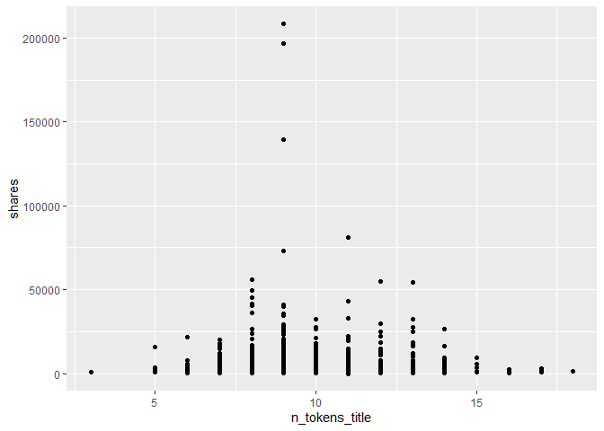
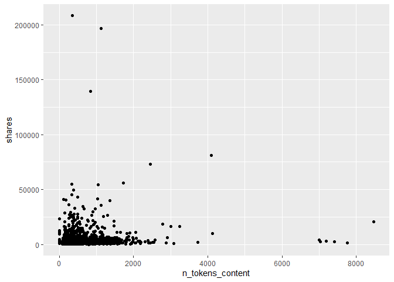
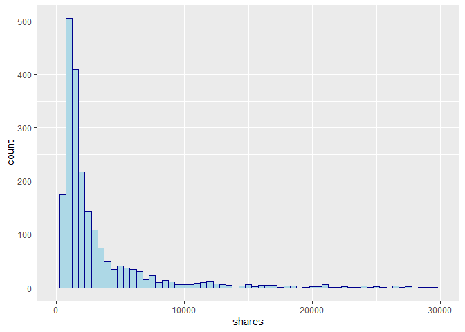
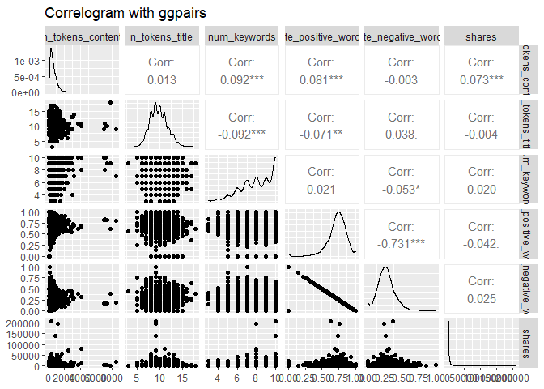
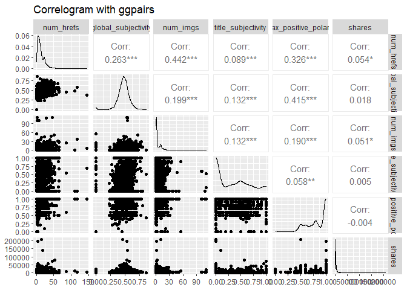
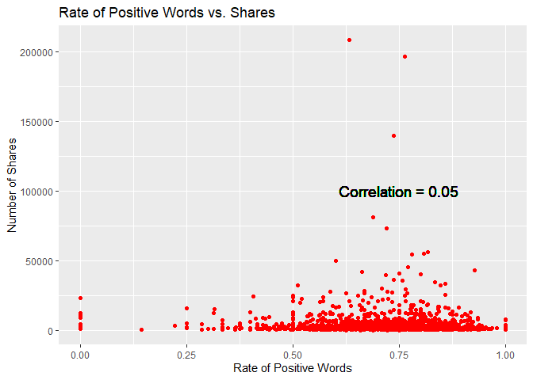

Project 2 - Predictive Models
================
Alex Prevatte & Chennade Brown  
10/31/2021

-   [Introduction](#introduction)
-   [Data](#data)
-   [Summarizations](#summarizations)
-   [Modeling](#modeling)
-   [Comparison](#comparison)
-   [Automation](#automation)

## Introduction

``` r
library(tidyverse)
library(dplyr)
library(knitr)
library(GGally)
library(corrplot)
library(caret)
library(randomForest)
```

## Data

``` r
# Import the Data.
 onlineNews <- read_csv("OnlineNewsPopularity.csv")
```

``` r
# Start with using data from a single data_channel_is_* source
variable.names(onlineNews)
```

    ##  [1] "url"                           "timedelta"                    
    ##  [3] "n_tokens_title"                "n_tokens_content"             
    ##  [5] "n_unique_tokens"               "n_non_stop_words"             
    ##  [7] "n_non_stop_unique_tokens"      "num_hrefs"                    
    ##  [9] "num_self_hrefs"                "num_imgs"                     
    ## [11] "num_videos"                    "average_token_length"         
    ## [13] "num_keywords"                  "data_channel_is_lifestyle"    
    ## [15] "data_channel_is_entertainment" "data_channel_is_bus"          
    ## [17] "data_channel_is_socmed"        "data_channel_is_tech"         
    ## [19] "data_channel_is_world"         "kw_min_min"                   
    ## [21] "kw_max_min"                    "kw_avg_min"                   
    ## [23] "kw_min_max"                    "kw_max_max"                   
    ## [25] "kw_avg_max"                    "kw_min_avg"                   
    ## [27] "kw_max_avg"                    "kw_avg_avg"                   
    ## [29] "self_reference_min_shares"     "self_reference_max_shares"    
    ## [31] "self_reference_avg_sharess"    "weekday_is_monday"            
    ## [33] "weekday_is_tuesday"            "weekday_is_wednesday"         
    ## [35] "weekday_is_thursday"           "weekday_is_friday"            
    ## [37] "weekday_is_saturday"           "weekday_is_sunday"            
    ## [39] "is_weekend"                    "LDA_00"                       
    ## [41] "LDA_01"                        "LDA_02"                       
    ## [43] "LDA_03"                        "LDA_04"                       
    ## [45] "global_subjectivity"           "global_sentiment_polarity"    
    ## [47] "global_rate_positive_words"    "global_rate_negative_words"   
    ## [49] "rate_positive_words"           "rate_negative_words"          
    ## [51] "avg_positive_polarity"         "min_positive_polarity"        
    ## [53] "max_positive_polarity"         "avg_negative_polarity"        
    ## [55] "min_negative_polarity"         "max_negative_polarity"        
    ## [57] "title_subjectivity"            "title_sentiment_polarity"     
    ## [59] "abs_title_subjectivity"        "abs_title_sentiment_polarity" 
    ## [61] "shares"

``` r
# filtered rows for data_channel_is_lifestyle and removed other 5 categories
# removed non-predictive variables
onlineNewsLifestyle <- onlineNews %>% filter(`data_channel_is_lifestyle` ==  1) %>% 
  select(- c(`data_channel_is_bus`, `data_channel_is_entertainment`,
             `data_channel_is_socmed`, `data_channel_is_tech`,
             `data_channel_is_world`, url, `timedelta`))

# Remove space in front of each column name
names(onlineNewsLifestyle) <- sub(" ", "", names(onlineNewsLifestyle))

# Convert to dataframe for plotting
onlineNewsLifestyle <- data.frame(onlineNewsLifestyle)
```

## Summarizations

``` r
# Summary statistics for shares
sum <- summary(onlineNewsLifestyle$shares)
std <- sd(onlineNewsLifestyle$shares)
median <- sum[3]
median
```

    ## Median 
    ##   1700

``` r
# Create Day variable to combine days for contingency table
dayShares <- onlineNewsLifestyle %>% 
  mutate(Day = if_else(weekday_is_monday == 1, "M",
                          if_else(weekday_is_tuesday == 1, "T",
                                  if_else(weekday_is_wednesday == 1, "W", 
                                          if_else(weekday_is_thursday == 1, "R",
                                                  if_else(weekday_is_friday == 1, "F",
                                          "Weekend"))))))

# Add Popular variable for rows where shares is greater than the median
dayShares <- dayShares %>% mutate(Popular = ifelse(shares > median, "Yes", "No")) %>% select(Popular, everything())

# Contingency table for day of the week and shares greater than the median
table(dayShares$Popular, factor(dayShares$Day, levels = c("M", "T", "W", 
                                                          "R", "F", "Weekend")))
```

    ##      
    ##         M   T   W   R   F Weekend
    ##   No  175 196 215 201 167     151
    ##   Yes 147 138 173 157 138     241

``` r
# Scatterplot of Number of words in title vs. shares
ggplot(onlineNewsLifestyle, aes(n_tokens_title, shares)) +
  geom_point()
```

<!-- -->

``` r
# Scatterplot of Number of words in content vs. shares
ggplot(onlineNewsLifestyle, aes(n_tokens_content, shares)) +
  geom_point()
```

<!-- -->

``` r
# Histogram of total shares. Median line drawn in
ggplot(onlineNewsLifestyle, aes(x=shares))+
  geom_histogram(binwidth = 500, color="darkblue", fill="lightblue") +
  xlim(0,30000) +
  geom_vline(aes(xintercept = median), colour="black")
```

    ## Warning: Removed 21 rows containing non-finite values (stat_bin).

    ## Warning: Removed 2 rows containing missing values (geom_bar).

<!-- -->

``` r
# Summary statistics for the number of words in the content.
sumWords <- summary(onlineNewsLifestyle$n_tokens_content)
sumWords
```

    ##    Min. 1st Qu.  Median    Mean 3rd Qu.    Max. 
    ##     0.0   308.5   502.0   621.3   795.0  8474.0

``` r
# Summary statistics for the number of links in the content. 
sumLinks <- summary(onlineNewsLifestyle$num_hrefs)
sumLinks
```

    ##    Min. 1st Qu.  Median    Mean 3rd Qu.    Max. 
    ##    0.00    6.00   10.00   13.42   18.00  145.00

``` r
# Summary statistics for the number of images in the content.
sumImages <- summary(onlineNewsLifestyle$num_imgs)
sumImages
```

    ##    Min. 1st Qu.  Median    Mean 3rd Qu.    Max. 
    ##   0.000   1.000   1.000   4.905   8.000 111.000

``` r
# Add Word variable for words to include low, average, and high word count and combine with dayshares dataframe for contingency table.
wordLinkShares <- dayShares %>% mutate(Words = if_else(n_tokens_content <= 500, "Low", if_else(n_tokens_content <= 625, "Average", "High")))
```

``` r
# Add Link variable for the number of links in the content to include low, average, and high count.
wordLinkShares <- wordLinkShares %>% mutate(Links = if_else(num_hrefs <= 9, "Low", if_else(num_hrefs <= 14, "Average","High")))

# Remove extra columns added to onLineNewsLifestyle.
onlineNewsLifestyle$WordCount <- NULL
onlineNewsLifestyle$Popular <- NULL
onlineNewsLifestyle$Words <- NULL
onlineNewsLifestyle$Links <- NULL
onlineNewsLifestyle$Day <- NULL
```

``` r
# Contingency table for the number of words in the content based on grouping the word count into categories of low, average, and high word count and grouping the shares based on popularity (shares greater than the median).
table(wordLinkShares$Popular, wordLinkShares$Words)
```

    ##      
    ##       Average High Low
    ##   No      142  384 579
    ##   Yes     136  390 468

``` r
# Contingency table for the number of links in the content based on grouping the link count into categories of low, average,and high and shares based on popularity (shares greater than the median)
table(wordLinkShares$Popular, wordLinkShares$Links)
```

    ##      
    ##       Average High Low
    ##   No      246  315 544
    ##   Yes     191  368 435

``` r
# Select predictors to view in GGPairs plot.
xpred <- onlineNewsLifestyle %>% select(n_tokens_content, n_tokens_title, num_keywords, rate_positive_words, rate_negative_words, shares)

xpred2 <- onlineNewsLifestyle %>% select(num_hrefs, global_subjectivity, num_imgs, title_subjectivity, max_positive_polarity, shares)

# GGPairs plot to view correlation among the predictors.  Correlation greater than 75% indicates the predictors are highly correlated.
ggpairs(xpred, title = "Correlogram with ggpairs")
```

<!-- -->

``` r
ggpairs(xpred2, title = "Correlogram with ggpairs")
```

<!-- -->

``` r
# The following scatterplot shows the trend of shares as a function of the number of links in the content.  An upward trend in the points indicates that articles with more links are shared more often.  A downward trend would indicate that articles with more links are shared less often.  If there is neither an upward or downward trend this indicates that the number of links in the article has no effect on whether the article will be shared.
correlation <- cor(onlineNewsLifestyle$shares, onlineNewsLifestyle$num_hrefs)  
g <- ggplot(onlineNewsLifestyle, aes(x = num_hrefs, y = shares)) + labs(y ="Number of Shares", x = "Number of Links")
g + geom_point(col = "red") + ggtitle("Number of Links vs. Shares") + geom_text(x = 125, y = 30000, size = 5, label = paste0("Correlation = ", round(correlation, 2)))
```

<!-- -->

``` r
# The following scatterplot shows the relationship between the rate of positive words in the articles and the number of shares.  If the plots are on an upward trajectory then articles with more positive words are shared the most.  If the plots are on a downward trend then the articles with the most positive words are shared the least.
correlationTwo <- cor(onlineNewsLifestyle$shares, onlineNewsLifestyle$rate_positive_words)  
g <- ggplot(onlineNewsLifestyle, aes(x = rate_positive_words, y = shares)) + labs(y ="Number of Shares", x = "Rate of Positive Words")
g + geom_point(col = "red") + ggtitle("Rate of Positive Words vs. Shares") + geom_text(x = 0.75, y = 100000, size = 5, label = paste0("Correlation = ", round(correlationTwo, 2)))
```

<!-- -->

## Modeling

``` r
# Split the data into a training (70% of the data) and test set (30% of the data).
set.seed(90)
trainIndex <- createDataPartition(onlineNewsLifestyle$shares, p = 0.7, list = FALSE)
onlineNewsTrain <- onlineNewsLifestyle[trainIndex, ]
onlineNewsTest <- onlineNewsLifestyle[-trainIndex, ]
dim(onlineNewsTrain)
```

    ## [1] 1472   54

``` r
dim(onlineNewsTest)
```

    ## [1] 627  54

### Linear Regression Models

A linear regression model is a model used to determine the relationship
between two or more variables by fitting a linear equation to the data.
The linear equation is in the form of: Y = Bo + B1X + E where Y is the
response variable, X is the explanatory variable, Bo is the y intercept,
and B1 is the slope. The model can be used to predict the value of the
response variable based on the values of the explanatory variables. For
example a linear regression model can be used to model the relationship
between years of experience and salary.

``` r
# Store model one in a formula.
modelOne <- as.formula("shares ~ n_tokens_content + n_tokens_title + rate_positive_words + num_keywords + global_subjectivity + max_positive_polarity + num_imgs")

# Fit the linear regression models.
fit1 <- train(modelOne, data = onlineNewsTrain,
              method = "lm",
              preProcess = c("center", "scale"),
              trControl = trainControl(method = "cv", number = 10))
fit1
```

    ## Linear Regression 
    ## 
    ## 1472 samples
    ##    7 predictor
    ## 
    ## Pre-processing: centered (7), scaled (7) 
    ## Resampling: Cross-Validated (10 fold) 
    ## Summary of sample sizes: 1324, 1325, 1324, 1325, 1324, 1325, ... 
    ## Resampling results:
    ## 
    ##   RMSE      Rsquared    MAE     
    ##   8388.512  0.01659042  3365.702
    ## 
    ## Tuning parameter 'intercept' was held constant at a value of TRUE

### Random Forest Model

Random Forest models are an extension of the tree based method bagging.
The random forest algorithm creates multiple trees from bootstrapped
samples, averages those results, and uses a random subset of predictors
for each bootstrap sample/tree fit. Random forests can be used for
classification and regression problems.

``` r
rfFit <- train(shares ~., data = onlineNewsTrain, 
               method = "rf", 
               trainControl = trainControl(method = "cv",
                                           number = 5),
               tuneGrid = data.frame(mtry = 1:8))
rfFit
```

    ## Random Forest 
    ## 
    ## 1472 samples
    ##   53 predictor
    ## 
    ## No pre-processing
    ## Resampling: Bootstrapped (25 reps) 
    ## Summary of sample sizes: 1472, 1472, 1472, 1472, 1472, 1472, ... 
    ## Resampling results across tuning parameters:
    ## 
    ##   mtry  RMSE       Rsquared     MAE     
    ##   1      9652.179  0.007640930  3478.284
    ##   2      9710.610  0.006792975  3587.933
    ##   3      9764.663  0.006386262  3628.687
    ##   4      9816.612  0.006124689  3666.316
    ##   5      9880.838  0.005556097  3692.846
    ##   6      9948.200  0.005178120  3723.199
    ##   7      9988.540  0.005312533  3730.708
    ##   8     10060.587  0.004808194  3764.121
    ## 
    ## RMSE was used to select the optimal model using the smallest value.
    ## The final value used for the model was mtry = 1.

## Comparison

``` r
# Compare linear regression model fit1 on the test set.
pred <- predict(fit1, newdata = onlineNewsTest)
postResample(pred, obs = onlineNewsTest$shares)
```

    ##         RMSE     Rsquared          MAE 
    ## 5.942093e+03 7.507867e-04 3.306149e+03

``` r
# Compare random forest model rfFit on the test set.
predForest <- predict(rfFit, newdata = onlineNewsTest)
postResample(predForest, onlineNewsTest$shares)
```

    ##         RMSE     Rsquared          MAE 
    ## 5.710658e+03 1.771297e-02 3.214227e+03

## Automation
