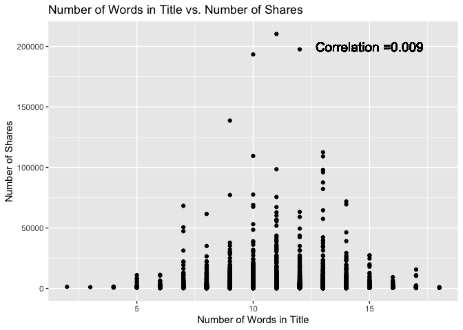
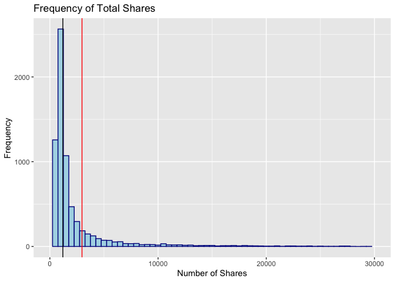
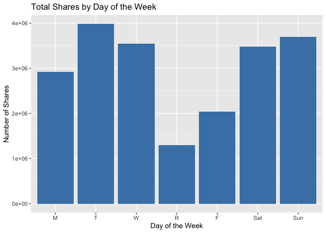
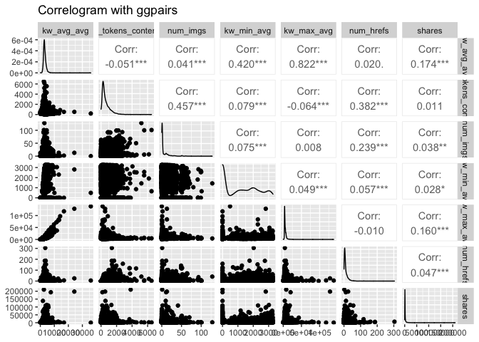
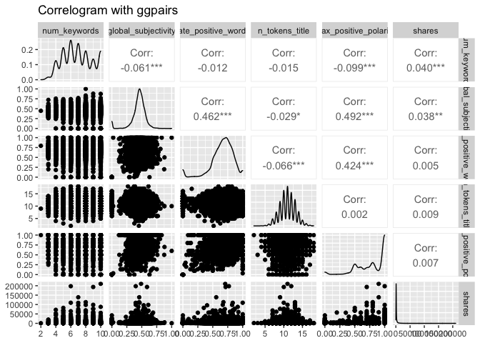
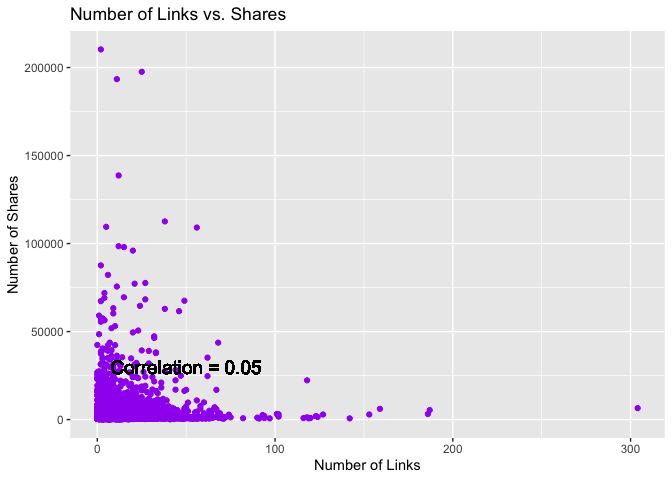
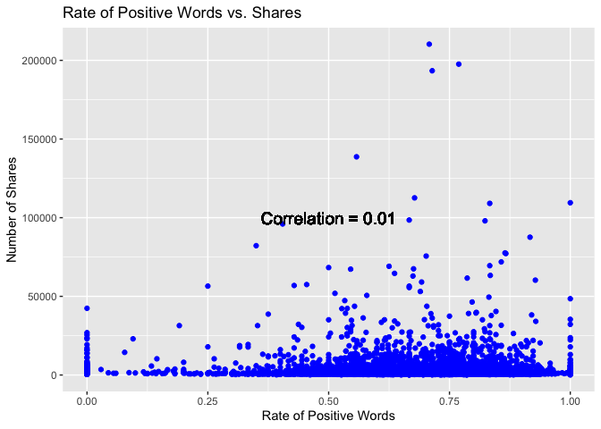

Entertainment Channel Predictive Modeling
================
Alex Prevatte & Chennade Brown
10/31/2021

-   [Introduction](#introduction)
-   [Data](#data)
-   [Summarizations](#summarizations)
-   [Modeling](#modeling)
    -   [Linear Regression Models](#linear-regression-models)
    -   [Random Forest Model](#random-forest-model)
    -   [Boosted Tree Model](#boosted-tree-model)
-   [Comparison](#comparison)

## Introduction

Our project involves creating predictive models and automating Markdown
reports for each data channel topic (Lifestyle, Social Media, Business,
World, Entertainment, and Technology) using the [Online News Popularity
Data
Set](https://archive.ics.uci.edu/ml/datasets/Online+News+Popularity).

This dataset contains quantitative information including the
`n_tokens_title`(number of words in title), `num_imgs` (number of
images), `rate_positive_words` (rate of positive words) and `num_hrefs`
(number of links) among several other variables. In addition,
qualitative information such as channel topic and the day the article
was shared was included.

The goal of this report is to predict the number of shares for each data
channel using linear regression, random forest, and boosted tree models.
Our team analyzed the data using 53 prediction attributes for ensemble
methods and a combination of the following attributes for linear
regression:

-   `n_tokens_title`: Number of words in the title
-   `n_tokens_content` : Number of words in the content
-   `rate_positive_words` : Rate of positive words among non-neutral
    tokens
-   `num_hrefs` : Number of links
-   `num_imgs` : Number of images
-   `num_keywords` : Number of keywords in the metadata
-   `global_subjectivity` : Text subjectivity
-   `max_positive_polarity` : Max. polarity of positive words
-   `num_imgs` : Number of images
-   `kw_avg_avg` : Avg. keyword (avg. shares)
-   `kw_min_avg` : Avg. keyword (min. shares)
-   `kw_max_avg` : Avg. keyword (max. shares)

The steps for this report include:

-   Loading in required packages
-   Import the data and subset by data channel
-   Perform exploratory analysis
-   Split the data into training and test sets
-   Train models using cross-validation (CV)
-   Evaluate models on the test set
-   Compare results

``` r
library(tidyverse)
library(dplyr)
library(knitr)
library(GGally)
library(caret)
library(randomForest)
library(doParallel)
```

## Data

``` r
# Import the Data.
onlineNews <- read_csv("OnlineNewsPopularity.csv")
```

``` r
# Create articleTopic variable from data_channel_is_* variables

onlineNews <- onlineNews %>% 
  mutate(articleTopic = if_else(`data_channel_is_lifestyle` == 1, "Lifestyle",
                          if_else(`data_channel_is_bus` == 1, "Business",
                                  if_else(`data_channel_is_entertainment` == 1, "Entertainment", 
                                          if_else(`data_channel_is_socmed` == 1, "Social Media",
                                                  if_else(`data_channel_is_tech` == 1,"Tech",
                                                          if_else(`data_channel_is_world` == 1, "World", "NULL")))))))

# Filtered rows based on articleTopic. Removed data_channel_is_* variables, and  
# non-predictive variables (URL, Timedelta, articleTopic).

onlineNews <- filter(onlineNews, articleTopic == params$topic) %>% 
  select(- c(url, `timedelta`, articleTopic, `data_channel_is_lifestyle`,
             `data_channel_is_bus`, `data_channel_is_entertainment`,
             `data_channel_is_socmed`, `data_channel_is_tech`, `data_channel_is_world`))

# Remove space in front of each column name
names(onlineNews) <- sub(" ", "", names(onlineNews))

# Convert to dataframe for plotting
onlineNews <- data.frame(onlineNews)
```

## Summarizations

``` r
# Summary statistics for shares
sum <- summary(onlineNews$shares)
std <- sd(onlineNews$shares)

# Median and mean to be used for histogram plot
median <- sum[3]
mean <- sum[4]
print(sum)
```

    ##    Min. 1st Qu.  Median    Mean 3rd Qu.    Max. 
    ##      47     833    1200    2970    2100  210300

``` r
# Summary statistics for Number of Words in Title
sum <- summary(onlineNews$n_tokens_title)
std <- sd(onlineNews$n_tokens_title)
print(sum)
```

    ##    Min. 1st Qu.  Median    Mean 3rd Qu.    Max. 
    ##       2      10      11      11      12      18

``` r
# Summary statistics for Number of Words in Content
sum <- summary(onlineNews$n_tokens_content)
std <- sd(onlineNews$n_tokens_content)
print(sum)
```

    ##    Min. 1st Qu.  Median    Mean 3rd Qu.    Max. 
    ##     0.0   255.0   433.0   607.5   805.0  6505.0

``` r
# Create Day variable to combine days for contingency table
dayShares <- onlineNews %>% 
  mutate(Day = if_else(weekday_is_monday == 1, "M",
                          if_else(weekday_is_tuesday == 1, "T",
                                  if_else(weekday_is_wednesday == 1, "W", 
                                          if_else(weekday_is_thursday == 1, "R",
                                                  if_else(weekday_is_friday == 1,"F",
                                                          if_else(weekday_is_saturday == 1,"Sat",
                                                                  if_else(weekday_is_sunday == 1,"Sun", "NULL"))))))))

# Add Popular variable for rows where shares is greater than the median
dayShares <- dayShares %>% mutate(Popular = 
                                    ifelse(shares > median, "Yes", "No")) %>% select(Popular, everything())
```

``` r
# Contingency table for day of the week and shares greater than the median. 
# This table shows the number of popular and unpopular shares by day of the week for
# this data channel. 

table(dayShares$Popular, factor(dayShares$Day, levels = c("M", "T", "W", 
                                                          "R", "F", "Sat", "Sun")))
```

    ##      
    ##         M   T   W   R   F Sat Sun
    ##   No  793 747 776 728 524 119 166
    ##   Yes 565 538 519 503 448 261 370

``` r
# Table of total shares for each day. This table includes both unpopular and popular shares
# for each day of the week. 
tableTotal <- aggregate(dayShares$shares, by=list(Day=dayShares$Day), FUN=sum)
colnames(tableTotal) <- c("Day", "Total_Shares")
tableTotal$Day <- factor(tableTotal$Day)
levels(tableTotal$Day) = c("M", "T", "W", "R", "F", "Sat", "Sun")
tableTotal
```

    ##   Day Total_Shares
    ## 1   M      2916920
    ## 2   T      3980347
    ## 3   W      3548004
    ## 4   R      1298232
    ## 5   F      2042670
    ## 6 Sat      3479822
    ## 7 Sun      3696732

``` r
# Scatterplot of Number of Words in Title vs. Number of Shares. If the correlation is 
# closer to 1, we should expect to see a higher number of shares with words in the title.
# If the correlation is closer to 0, we should not expect to see a linear relationship 
# between number of words in the title and shares. 

titleCorrelation <- cor(onlineNews$shares, onlineNews$n_tokens_title)

ggplot(onlineNews, aes(n_tokens_title, shares)) + 
  labs(y = "Number of Shares", x = "Number of Words in Title") +
  ggtitle("Number of Words in Title vs. Number of Shares") +
  geom_point() + 
  geom_text(x = 15, y = 200000, size = 5, 
            label = paste0("Correlation =", round(titleCorrelation, 3)))
```

<!-- -->

``` r
# Histogram of total shares for the data channel. Mean and median vertical lines have been
# included to show different thresholds for popularity. The black line indicates the median
# total shares and the red line represents the mean total shares. Since we are using the median 
# as the indicator for popularity, article shares greater than the black line would indicate
# popularity.

ggplot(onlineNews, aes(x=shares)) +
  labs(y = "Frequency", x = "Number of Shares") +
  ggtitle("Frequency of Total Shares") +
  geom_histogram(binwidth = 500, color="darkblue", fill="lightblue") +
  xlim(0,30000) +
  geom_vline(aes(xintercept = median), colour="black") + 
  geom_vline(aes(xintercept = mean), colour="red")
```

<!-- -->

``` r
# Barplot of Total Shares vs. Day of the Week. This barplot shows the trend in
# total article shares for each day of the week. This plot will show us which days
# are most popular for article sharing. 

ggplot(tableTotal, aes(x=Day, y = Total_Shares)) +
  geom_bar(stat="identity", fill = "steelblue") +
  labs(y = "Number of Shares", x = "Day of the Week") +
  ggtitle("Total Shares by Day of the Week") 
```

<!-- -->

``` r
# Summary statistics for the number of words in the content.
sumWords <- summary(onlineNews$n_tokens_content)
sumWords
```

    ##    Min. 1st Qu.  Median    Mean 3rd Qu.    Max. 
    ##     0.0   255.0   433.0   607.5   805.0  6505.0

``` r
# Summary statistics for the number of links in the content. 
sumLinks <- summary(onlineNews$num_hrefs)
sumLinks
```

    ##    Min. 1st Qu.  Median    Mean 3rd Qu.    Max. 
    ##    0.00    4.00    7.00   10.69   13.00  304.00

``` r
# Summary statistics for the number of images in the content.
sumImages <- summary(onlineNews$num_imgs)
sumImages
```

    ##    Min. 1st Qu.  Median    Mean 3rd Qu.    Max. 
    ##   0.000   1.000   1.000   6.318   8.000 128.000

``` r
# Add Word variable for words to include low, average, and high word count and combine with dayshares dataframe for contingency table.
wordLinkShares <- dayShares %>% mutate(Words = if_else(n_tokens_content <= 500, "Low", if_else(n_tokens_content <= 625, "Average", "High")))
```

``` r
# Add Link variable for the number of links in the content to include low, average, and high count.
wordLinkShares <- wordLinkShares %>% mutate(Links = if_else(num_hrefs <= 9, "Low", if_else(num_hrefs <= 14, "Average","High")))

# Remove extra columns added to onLineNewsLifestyle.
onlineNews$WordCount <- NULL
onlineNews$Popular <- NULL
onlineNews$Words <- NULL
onlineNews$Links <- NULL
onlineNews$Day <- NULL
```

``` r
# Contingency table for the number of words in the content based on grouping the word count into categories of low, average, and high word count and grouping the shares based on popularity (shares greater than the median).
table(wordLinkShares$Popular, factor(wordLinkShares$Words, levels = c("Low", "Average", "High")))
```

    ##      
    ##        Low Average High
    ##   No  2175     353 1325
    ##   Yes 1787     284 1133

``` r
# Contingency table for the number of links in the content based on grouping the link count into categories of low, average,and high and shares based on popularity (shares greater than the median)
table(wordLinkShares$Popular, factor(wordLinkShares$Links, levels = c("Low", "Average", "High")))
```

    ##      
    ##        Low Average High
    ##   No  2609     472  772
    ##   Yes 1955     425  824

``` r
# Select predictors to view in GGPairs plot.
xpred <- onlineNews %>% select(kw_avg_avg, n_tokens_content, num_imgs, kw_min_avg, kw_max_avg, num_hrefs, shares)

xpred2 <- onlineNews %>% select(num_keywords, global_subjectivity, rate_positive_words, n_tokens_title, max_positive_polarity, shares)

# GGPairs plot to view correlation among the predictors.  Correlation greater than 75% indicates the predictors are highly correlated.
ggpairs(xpred, title = "Correlogram with ggpairs")
```

<!-- -->

``` r
ggpairs(xpred2, title = "Correlogram with ggpairs")
```

<!-- -->

``` r
# The following scatterplot shows the trend of shares as a function of the number of links in the content.  An upward trend in the points indicates that articles with more links are shared more often.  A downward trend would indicate that articles with more links are shared less often.  If there is neither an upward or downward trend this indicates that the number of links in the article has no effect on whether the article will be shared.
correlation <- cor(onlineNews$shares, onlineNews$num_hrefs)  
g <- ggplot(onlineNews, aes(x = num_hrefs, y = shares)) + labs(y ="Number of Shares", x = "Number of Links")
g + geom_point(col = "purple") + ggtitle("Number of Links vs. Shares") + geom_text(x = 50, y = 30000, size = 5, label = paste0("Correlation = ", round(correlation, 2)))
```

<!-- -->

``` r
# The following scatterplot shows the relationship between the rate of positive words in the articles and the number of shares.  If the plots are on an upward trajectory then articles with more positive words are shared the most.  If the plots are on a downward trend then the articles with the most positive words are shared the least.
correlationTwo <- cor(onlineNews$shares, onlineNews$rate_positive_words)  
g <- ggplot(onlineNews, aes(x = rate_positive_words, y = shares)) + labs(y ="Number of Shares", x = "Rate of Positive Words")
g + geom_point(col = "blue") + ggtitle("Rate of Positive Words vs. Shares") + geom_text(x = 0.5, y = 100000, size = 5, label = paste0("Correlation = ", round(correlationTwo, 2)))
```

<!-- -->

## Modeling

``` r
# Split the data into a training (70% of the data) and test set (30% of the data).
set.seed(90)
trainIndex <- createDataPartition(onlineNews$shares, p = 0.7, list = FALSE)
onlineNewsTrain <- onlineNews[trainIndex, ]
onlineNewsTest <- onlineNews[-trainIndex, ]
dim(onlineNewsTrain)
```

    ## [1] 4941   53

``` r
dim(onlineNewsTest)
```

    ## [1] 2116   53

### Linear Regression Models

A linear regression model is a model used to determine the relationship
between two or more variables by fitting a linear equation to the data.
The linear equation is in the form of: Y = Bo + B1X + E where Y is the
response variable, X is the explanatory variable, Bo is the y intercept,
and B1 is the slope. The model can be used to predict the value of the
response variable based on the values of the explanatory variables. For
example a linear regression model can be used to model the relationship
between years of experience and salary.

``` r
# Use parallel computing for our models
cl <- makePSOCKcluster(5)
registerDoParallel(cl)

# Store model one in a formula.
modelOne <- as.formula("shares ~ n_tokens_content + n_tokens_title + rate_positive_words + num_keywords + global_subjectivity + max_positive_polarity + num_imgs")

# Model fit on the training data.
fit1 <- train(modelOne, data = onlineNewsTrain,
              method = "lm",
              preProcess = c("center", "scale"),
              trControl = trainControl(method = "cv", number = 10))
fit1
```

    ## Linear Regression 
    ## 
    ## 4941 samples
    ##    7 predictor
    ## 
    ## Pre-processing: centered (7), scaled (7) 
    ## Resampling: Cross-Validated (10 fold) 
    ## Summary of sample sizes: 4447, 4448, 4447, 4447, 4448, 4447, ... 
    ## Resampling results:
    ## 
    ##   RMSE      Rsquared     MAE     
    ##   6892.047  0.008437501  2876.538
    ## 
    ## Tuning parameter 'intercept' was held constant at a value of TRUE

``` r
# Backward selection chosen for additional linear model
modelTwo <- as.formula("shares ~ kw_avg_avg + kw_min_avg + kw_max_avg + num_hrefs + n_tokens_content")

# Model fit on training data
fit2 <- train(modelTwo, data = onlineNewsTrain,
              method = "lm",
              preProcess = c("center", "scale"),
              trControl = trainControl(method = "cv", number = 10))
fit2
```

    ## Linear Regression 
    ## 
    ## 4941 samples
    ##    5 predictor
    ## 
    ## Pre-processing: centered (5), scaled (5) 
    ## Resampling: Cross-Validated (10 fold) 
    ## Summary of sample sizes: 4447, 4447, 4446, 4446, 4449, 4448, ... 
    ## Resampling results:
    ## 
    ##   RMSE     Rsquared  MAE     
    ##   6908.61  0.034149  2817.638
    ## 
    ## Tuning parameter 'intercept' was held constant at a value of TRUE

### Random Forest Model

Random Forest models are an extension of the tree based method bagging.
The random forest algorithm creates multiple trees from bootstrapped
samples, includes a random subset of predictors in each tree, and
predicts based on the average of the results from those trees. Random
forests can be used for classification and regression problems.

``` r
rfFit <- train(shares ~., data = onlineNewsTrain, 
               method = "rf", 
               trainControl = trainControl(method = "cv",
                                           number = 5),
               tuneGrid = data.frame(mtry = 1:10))
rfFit
```

    ## Random Forest 
    ## 
    ## 4941 samples
    ##   52 predictor
    ## 
    ## No pre-processing
    ## Resampling: Bootstrapped (25 reps) 
    ## Summary of sample sizes: 4941, 4941, 4941, 4941, 4941, 4941, ... 
    ## Resampling results across tuning parameters:
    ## 
    ##   mtry  RMSE      Rsquared    MAE     
    ##    1    6694.951  0.03341560  2794.933
    ##    2    6706.354  0.03513368  2861.495
    ##    3    6728.111  0.03524463  2893.328
    ##    4    6753.641  0.03402261  2918.142
    ##    5    6773.057  0.03343033  2939.000
    ##    6    6795.975  0.03276089  2952.325
    ##    7    6815.077  0.03211705  2970.610
    ##    8    6824.963  0.03198634  2974.663
    ##    9    6836.567  0.03219038  2985.879
    ##   10    6857.526  0.03161095  2995.898
    ## 
    ## RMSE was used to select the optimal model using the smallest value.
    ## The final value used for the model was mtry = 1.

### Boosted Tree Model

Boosting is an ensemble tree-based method used for regression and
classification. Boosting seeks to improve prediction by training on
decision trees which are grown sequentially. Each subsequent tree is
grown on a modified version of the original data. The predictions are
then updated as new trees are grown, minimizing the error of the
previous tree. The parameters used in boosting are the number of trees,
interaction depth (number of splits on a tree), shrinkage, and minimum
number of observations in trees’ terminal nodes.

``` r
# Boosted tree. After examining ranges of values for number of trees and interaction depth, 25 trees with an interaction depth of 1 had the lowest test RMSE.
boostedGrid <- expand.grid(
  interaction.depth=c(1:4), 
  n.trees=c(25,50,100,150,200),
  shrinkage=0.1,
  n.minobsinnode=10
)

boostedTree <- train(shares ~., 
                     data = onlineNewsTrain,
             method = "gbm",
             preProcess = c("center", "scale"),
             trControl = trainControl(method = "repeatedcv", number = 5,
                                      repeats = 3),
             tuneGrid = boostedGrid)

# End parallel computing
stopCluster(cl)
```

## Comparison

``` r
# Test error computed for the first linear model.
pred <- predict(fit1, newdata = onlineNewsTest)
m <- postResample(pred, obs = onlineNewsTest$shares)

# Test error computed for the backwards selection linear model.
pred2 <- predict(fit2, newdata = onlineNewsTest)
p <- postResample(pred2, obs = onlineNewsTest$shares)

# Test error computed for the random forest model.
predForest <- predict(rfFit, newdata = onlineNewsTest)
n <- postResample(predForest, onlineNewsTest$shares)

# Test error computed for the boosted tree model.
predBoost <- predict(boostedTree, newdata = onlineNewsTest)
p2 <- postResample(predBoost, obs = onlineNewsTest$shares)


# Produce a table for all comparisons
comparisons <- t(rbind(p[1],p2[1],m[1],n[1]))
colnames(comparisons) <- c("Linear Model Backwards Selection", "Boosted Tree", "Linear Model One", "Random Forest")
comparisons
```

    ##      Linear Model Backwards Selection Boosted Tree Linear Model One
    ## RMSE                          9223.64     9222.823         9349.018
    ##      Random Forest
    ## RMSE      9226.958

``` r
# Compare RMSE values and store in a data frame.
LmOneRmse <- sqrt(mean((pred-onlineNewsTest$shares)^2))
LmBackSel <- sqrt(mean((pred2-onlineNewsTest$shares)^2))
rForestRmse <- sqrt(mean((predForest-onlineNewsTest$shares)^2))
tree <- sqrt(mean((predBoost-onlineNewsTest$shares)^2))
modelRmse <- c(LinearModelOne = LmOneRmse, LinearModelBckSel = LmBackSel, rForest = rForestRmse, boostedTree = tree)

# Store results in a data frame.
df <- as.data.frame(modelRmse)

# Name the column in the data frame.
attributes(df)$names[1] <- "RMSE"
df
```

    ##                       RMSE
    ## LinearModelOne    9349.018
    ## LinearModelBckSel 9223.640
    ## rForest           9226.958
    ## boostedTree       9222.823

``` r
# Use the apply function to return the model with the lowest RMSE which is the final winner.
apply(X = select(df, RMSE), MARGIN = 2,
      FUN = function(x){
        winner <- df %>% slice_min(RMSE)
        names(winner) <- c("Winner")
        winner
      })
```

    ## $RMSE
    ##               Winner
    ## boostedTree 9222.823
